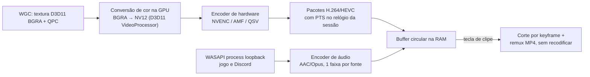
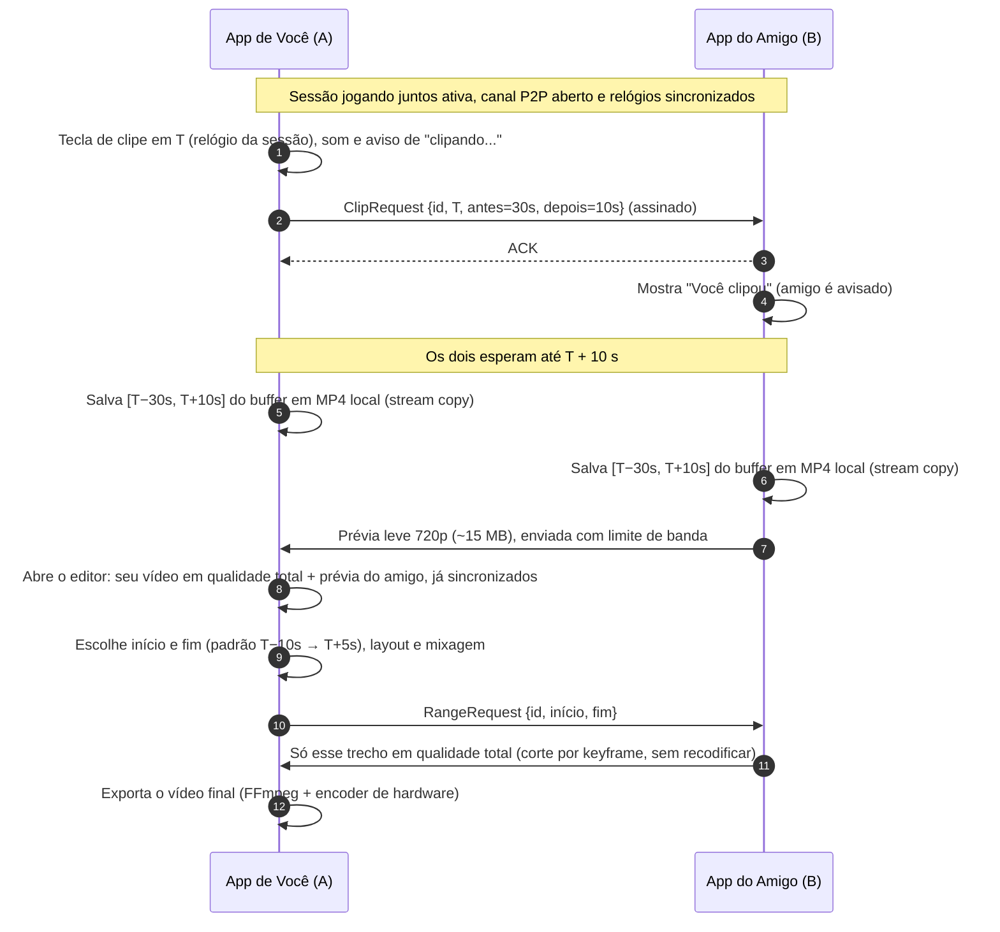

# App de clipes sincronizados entre amigos — Pesquisa e proposta de arquitetura

> **Nome provisório:** DuoClip · **Plataforma:** Windows 10/11 · **Pesquisa feita em:** outubro de 2026
>
> Objetivo: dois (ou mais) amigos jogando juntos, cada um com o app aberto. O app grava a tela do jogo
> de forma contínua e leve (como Medal, OBS e ShadowPlay). Quando acontece algo engraçado, um deles aperta
> a tecla de clipe e o app salva **a tela dos dois, sincronizada no tempo**. Depois abre uma prévia para
> escolher onde o clipe começa e termina. O app grava **só o jogo, o som do jogo e as vozes do Discord**.

---

## Sumário

1. [Resumo da recomendação](#1-resumo-da-recomendação)
2. [Requisitos](#2-requisitos)
3. [O que já existe no mercado](#3-o-que-já-existe-no-mercado)
4. [Captura de vídeo](#4-captura-de-vídeo)
5. [Codificação por hardware e buffer de replay](#5-codificação-por-hardware-e-buffer-de-replay)
6. [Áudio: só o jogo + Discord](#6-áudio-só-o-jogo--discord)
7. [Sincronização "exata" entre dois PCs](#7-sincronização-exata-entre-dois-pcs)
8. [Fluxo completo de um clipe](#8-fluxo-completo-de-um-clipe)
9. [Rede: pareamento, conexão P2P e transferência](#9-rede-pareamento-conexão-p2p-e-transferência)
10. [Editor / pré-visualização](#10-editor--pré-visualização)
11. [Segurança e privacidade](#11-segurança-e-privacidade)
12. [Stack tecnológica: opções e recomendação](#12-stack-tecnológica-opções-e-recomendação)
13. [Distribuição, assinatura e requisitos mínimos](#13-distribuição-assinatura-e-requisitos-mínimos)
14. [Roadmap sugerido](#14-roadmap-sugerido)
15. [Riscos e como mitigar](#15-riscos-e-como-mitigar)
16. [Fontes](#16-fontes)

---

## 1. Resumo da recomendação

| Tema | Decisão recomendada | Por quê |
|---|---|---|
| Captura de vídeo | **Windows.Graphics.Capture (WGC)** apontado para a **janela do jogo** | API oficial do Windows. Não injeta nada no jogo, o que evita problemas com anti-cheat. Captura só a janela escolhida, e o frame já chega como textura na GPU. |
| Codificação | **Encoder de hardware da GPU** (NVIDIA NVENC, AMD AMF, Intel Quick Sync) num pipeline **zero-copy** | É o que Medal, OBS e ShadowPlay fazem. O encoder é um bloco dedicado do chip, então o impacto no FPS é mínimo. |
| Buffer de replay | Fila circular **na RAM** de pacotes já codificados, com keyframe a cada 1 s | Sem escrita contínua em disco. O corte do clipe sai em milissegundos, sem recodificar. |
| Áudio | **WASAPI process loopback**: uma captura para o processo do jogo e outra para o processo do Discord, em **faixas separadas** | Grava apenas esses dois apps. Spotify, navegador e notificações ficam de fora. |
| Sincronização | Carimbo de tempo **QPC** em cada frame e pacote de áudio + **medição contínua da diferença de relógio** entre os PCs (estilo NTP, direto entre eles) | Precisão esperada de poucos ms, abaixo de 1 frame a 60 fps (16,7 ms). O editor tem ajuste fino de ±1 frame. |
| Rede | **WebRTC DataChannel** P2P criptografado + servidor mínimo de *signaling* + **TURN** de reserva | Os vídeos vão direto de um PC para o outro, criptografados. O servidor nunca vê o conteúdo. |
| Prévia | Amigo envia na hora uma **prévia leve (720p)**. Depois de você escolher início e fim, vem **só o trecho escolhido em qualidade total** | A prévia chega rápido e economiza upload, o que não atrapalha o ping de quem ainda está jogando. |
| Stack | **Núcleo em Rust** (windows-rs + FFmpeg/libavcodec em build LGPL) + **interface em Tauri 2** (WebView2) | Desempenho nativo, segurança de memória no código de rede e app leve. |
| Distribuição | **Microsoft Store** (cadastro gratuito para pessoa física desde set/2025; a Microsoft assina o pacote) | Resolve a assinatura de código e as atualizações automáticas. Também dá a identidade de pacote exigida para remover a borda amarela da captura. |

---

## 2. Requisitos

**Funcionais**

- **R1:** gravar continuamente (em buffer) a janela do jogo em alta qualidade, com impacto mínimo no FPS.
- **R2:** gravar o áudio do jogo e as vozes do Discord. Microfone próprio fica como opção, desligado por padrão.
- **R3:** uma tecla ou botão de clipe que, apertado por qualquer um, dispara o clipe **nos dois PCs**.
- **R4:** o clipe inclui *N* segundos antes e *M* segundos depois do aperto (configurável).
- **R5:** os vídeos dos dois ficam sincronizados no tempo.
- **R6:** pré-visualização com os dois vídeos, para escolher início e fim e o layout (lado a lado, vertical, PiP...).
- **R7:** funcionar com qualquer jogo, qualquer GPU moderna, no Windows 10/11 ("universal").

**Não funcionais**

- **Segurança:** sem injeção no jogo, sem driver, sem precisar de administrador. Tudo criptografado na rede.
- **Privacidade:** captura só o jogo e o Discord, nunca a área de trabalho inteira por padrão.
- **Desempenho:** perda de FPS abaixo de ~3–5% (meta a validar com medição) e uso de rede que não piore o ping.

---

## 3. O que já existe no mercado

Nenhuma ferramenta encontrada **dispara o clipe nos dois PCs ao mesmo tempo com sincronia por relógio**. O que existe:

| Produto | O que faz | Diferença para a nossa ideia |
|---|---|---|
| **Medal** — "Clips You're In" / tag de squad | Encontra clipes que *outros* jogadores fizeram e em que você aparece. Depende de vincular conta Riot, Roblox ou Steam. No CS2, marca o time automaticamente. | Não grava a tela do amigo quando *você* aperta, e não sincroniza os dois POVs num editor. |
| **Medal Sessions** (2021) | Espaço compartilhado para gravar e editar clipes em grupo | Não encontrei confirmação de que ainda funciona assim hoje. |
| **MultiView Sync Player** (Microsoft Store) | Abre até 4 vídeos locais e alinha pela forma de onda do áudio ("Auto Sync") | Funciona *depois* da gravação, e cada um precisa gravar e enviar o arquivo. |
| **VOD Review** | Revisão de partidas com vários POVs, com início ajustado manualmente e correção de drift | Feito para análise de VODs. Não grava nada. |
| **MultiPOV** | Junta lives e VODs de vários streamers e alinha pelo som | Só funciona com YouTube, Twitch e Kick. Não usa arquivos locais. |
| **Multi-video-syncer** (GitHub) | Alinha vídeos locais por "pontos âncora" marcados quadro a quadro | Projeto de desenvolvedor, com alinhamento manual. |

**Conclusão:** há espaço para o produto. O diferencial é o **gatilho compartilhado em tempo real** e a **sincronia automática por relógio**, sem precisar de alinhamento manual depois.

---

## 4. Captura de vídeo

### 4.1 Os três métodos de captura no Windows

| Método | Como funciona | Prós | Contras |
|---|---|---|---|
| **Windows.Graphics.Capture (WGC)** | API do Windows (desde o Win10 1803) que entrega os frames de uma **janela** ou de um **monitor** como textura Direct3D 11 | Não toca no processo do jogo. Captura só a janela escolhida. Funciona entre GPUs (notebooks híbridos). Captura frames de *frame generation* (um relato do OBS mostrou que o DXGI capturava antes do Frame Generation da NVIDIA e o WGC corrigia). | Borda amarela (removível; veja 4.3). Não funciona com fullscreen exclusivo "de verdade". |
| **DXGI Desktop Duplication** | Copia o **monitor inteiro** já composto | Independe da API gráfica do jogo | Pega tudo que está na tela (notificações, outras janelas), o que é ruim para privacidade. Precisa rodar na mesma GPU do monitor. Há relatos de que derruba o FPS do jogo. |
| **Game hook (injeção)**, como o "Game Capture" do OBS | Injeta uma DLL no jogo e intercepta as chamadas DirectX, Vulkan ou OpenGL | Muito eficiente e funciona em fullscreen exclusivo | **Injeção de código é exatamente o que anti-cheats procuram.** O OBS é tolerado por ser conhecido e ter certificado próprio, mas um app novo seria bloqueado ou poderia gerar ban. Atualizações do Vanguard (Valorant/LoL) já chegaram a quebrar o Game Capture do próprio OBS. Também pode exigir administrador. |

**Decisão: WGC em modo janela.** Isso atende ao mesmo tempo os requisitos de segurança (sem injeção), privacidade (só a janela do jogo) e universalidade (qualquer API gráfica: DX11, DX12, Vulkan, OpenGL). Pela borda amarela e pelo comportamento descrito na documentação, o "Advanced Window Capture" do Medal parece ser exatamente isso, embora o Medal não confirme publicamente.

### 4.2 Detalhes importantes do WGC

- **Carimbo de tempo:** cada `Direct3D11CaptureFrame` traz `SystemRelativeTime`, o valor do **QPC** (QueryPerformanceCounter) no momento em que o compositor renderizou o frame. Esse é o relógio usado em toda a sincronização (seção 7).
- **Só a janela:** a captura de janela pega o conteúdo da própria janela do jogo. Outras janelas por cima, como o próprio app ou o Discord, não aparecem. A exceção são *overlays desenhados dentro do jogo* (Steam, Discord e outros, dependendo do modo), que fazem parte da imagem do jogo.
- **Cursor:** `IsCursorCaptureEnabled` (Win10 2004+) permite esconder o cursor do Windows. Em jogos, normalmente queremos desligado.
- **Taxa de captura:** no Windows 11 24H2 (build 26100) existe `MinUpdateInterval`, que limita a taxa de frames. Um teste da comunidade mostra que 17 ms ≈ 60 fps e 25 ms ≈ 40 fps, e que valores abaixo de 1 ms se comportam de forma estranha. Use o limite para não capturar 240 fps quando a gravação é a 60.
- **Tela parada:** no 24H2, o WGC pode **deixar de entregar frames quando o conteúdo não muda**. O encoder deve repetir o último frame para manter a taxa constante (CFR), senão a linha do tempo fica com "buracos".
- **Fullscreen exclusivo:** a captura de janela não funciona nesse modo (o Medal documenta a mesma limitação). Hoje, a maioria dos jogos em "tela cheia" roda na prática como *borderless flip model*, graças às *Fullscreen Optimizations* do Windows, e aí funciona. O app deve detectar a falha e pedir "use Tela cheia sem bordas". Opcionalmente, pode oferecer como plano B a captura do **monitor** via WGC, com aviso de privacidade.
- **Janelas protegidas:** se um app ou jogo usar `SetWindowDisplayAffinity` (`WDA_EXCLUDEFROMCAPTURE` / `WDA_MONITOR`), a janela sai preta ou some da captura. Isso deve ser **respeitado**; contornar seria antiético e arriscado.
- **OpenGL (ex.: Minecraft Java):** o Medal relata efeitos colaterais da captura de janela (cursor invisível, borda). Vale testar caso a caso.

### 4.3 A borda amarela

- Por padrão, o Windows desenha uma borda amarela na janela capturada (indicador de privacidade). Ela **não aparece no vídeo**, só na tela.
- Para removê-la, é preciso o **build 20348+**, `GraphicsCaptureAccess.RequestAccessAsync(GraphicsCaptureAccessKind.Borderless)` (que mostra um pedido de consentimento ao usuário) e a capability **`graphicsCaptureWithoutBorder`** no **manifesto de pacote** (MSIX). Depois disso, basta definir `IsBorderRequired = false`.
- Se o usuário negar, a propriedade é aceita mas ignorada, e a borda continua. Detecte a disponibilidade em tempo de execução com `ApiInformation.IsPropertyPresent`, como o OBS faz.
- O Windows 11 também tem uma configuração por app para isso ("Captura de gráficos" nas configurações de privacidade).
- **Implicação:** distribuir como **pacote MSIX** (Store ou sideload) é o caminho natural (seção 13).

---

## 5. Codificação por hardware e buffer de replay

### 5.1 Pipeline zero-copy (tudo na GPU)



- **A imagem nunca vai para a CPU.** Copiar a textura para a RAM é o que deixa gravadores ruins pesados. O wiki do FFmpeg ressalta que mover frames para a CPU adiciona overhead em comparação com manter tudo na GPU.
- **Acesso aos encoders:** o caminho mais prático é o **FFmpeg/libavcodec** (`h264_nvenc`, `hevc_nvenc`, `av1_nvenc`, `h264_amf`, `h264_qsv`...) com frames de hardware D3D11. O filtro `ddagrab` do FFmpeg já demonstra esse padrão (texturas D3D11 entregues direto ao NVENC). Outra opção é usar os SDKs nativos (NVIDIA Video Codec SDK, AMD AMF, Intel oneVPL), como faz o OBS.
- **Cuidado com o Media Foundation:** em pelo menos um teste documentado, o driver da NVIDIA não registrou um encoder H.264 de hardware via MFT. Depender só do Media Foundation pode cair em codificação por software em algumas máquinas.
- **Atalho para protótipo:** o **FFmpeg 8.1** ganhou o filtro **`gfxcapture`** (WGC por janela). Serve para um protótipo rápido na linha de comando antes de escrever o pipeline próprio. Ainda é preciso verificar se ele entrega frames D3D11 sem cópia para a CPU.

### 5.2 Configuração de codificação sugerida

| Parâmetro | Valor sugerido | Observação |
|---|---|---|
| Codec de gravação | **H.264** no MVP; HEVC/AV1 como opção | H.264 toca em qualquer lugar (WebView2, WhatsApp, Discord). AV1 e HEVC geram arquivos menores, mas exigem GPU mais nova e têm compatibilidade de reprodução pior. |
| Resolução / FPS | Nativa (ou 1080p) a 60 fps | Use `MinUpdateInterval` para não capturar além da taxa de gravação. |
| Controle de taxa | VBR ou CQP com teto (~30–50 Mbps em 1080p60) | Com bitrate constante, o tamanho do buffer é previsível. Com CQP, é preciso um limite de memória. |
| **Intervalo de keyframe** | **1 s** | Cortes precisos e clipes com duração exata. Intervalos longos ou "0" causam problemas no replay buffer do OBS. |
| B-frames | 0–2 | Menos latência e cortes mais simples |
| Prioridade | Threads de captura e codificação **abaixo do normal**. Nunca competir com o jogo. | |
| Segunda codificação "proxy" (opcional) | 720p a ~3 Mbps em paralelo | Deixa a prévia pronta na hora, sem transcodificar. Verifique o limite de sessões simultâneas do encoder da GPU. |

### 5.3 Buffer de replay

- **Estrutura:** uma fila de pacotes codificados `(pts_sessão, é_keyframe, faixa, bytes)`. A fila descarta do início em blocos de GOP, ou seja, de keyframe a keyframe.
- **Extração de um clipe `[início, fim]`:** encontrar o último keyframe ≤ `início`, copiar os pacotes até `fim` e fazer o remux para MP4 (*stream copy*). Isso leva milissegundos e não perde qualidade.
- **Uso de RAM** (bitrate × duração ÷ 8):

| Bitrate | 30 s | 60 s | 120 s |
|---|---|---|---|
| 20 Mbps | 75 MB | 150 MB | 300 MB |
| 30 Mbps | 113 MB | 225 MB | 450 MB |
| 50 Mbps | 188 MB | 375 MB | 750 MB |

- **Padrão sugerido:** buffer de **60 s**. A janela salva por clipe é de **30 s antes + 10 s depois** do aperto (configurável), e o corte inicial no editor é de **10 s antes + 5 s depois**.
- Se o usuário nunca apertar o botão, nada é escrito em disco (o Medal faz o mesmo).

### 5.4 Como medir o impacto

- Use o **PresentMon** (Intel/Microsoft) para medir frame time com o app ligado e desligado, no mesmo jogo e na mesma cena.
- Teste nos modos borderless e "tela cheia", em GPUs NVIDIA, AMD e Intel, e em notebook híbrido.
- Meta: perda de FPS médio < 3–5% e nenhum aumento perceptível no 1% low.

---

## 6. Áudio: só o jogo + Discord

### 6.1 A API certa: process loopback

O Windows permite capturar o áudio **de um processo específico e de seus processos filhos**, sem pegar o resto do sistema:

- `ActivateAudioInterfaceAsync` com `AUDIOCLIENT_ACTIVATION_PARAMS` → `AUDIOCLIENT_ACTIVATION_TYPE_PROCESS_LOOPBACK`
- `AUDIOCLIENT_PROCESS_LOOPBACK_PARAMS { TargetProcessId, PROCESS_LOOPBACK_MODE_INCLUDE_TARGET_PROCESS_TREE }`
- Os parâmetros vão num `PROPVARIANT` do tipo BLOB. Esse cliente **não** vem do `IMMDeviceEnumerator` tradicional.
- **Versão do Windows:** a documentação oficial exige o **build 20348+** (Windows 11). Na prática, OBS e GStreamer usam desde o **19041 (Win10 2004)**. O OBS documenta "Application Audio Capture" para o Windows 10 2004+ e o Windows 11. A recomendação é tentar ativar em tempo de execução e, se falhar, avisar o usuário.
- Se o processo-alvo não estiver tocando nada, a captura recebe **silêncio**, o que é normal.
- A Microsoft tem um exemplo oficial: *ApplicationLoopback* (Windows-classic-samples).

### 6.2 Duas capturas, faixas separadas

| Faixa | Fonte | Como encontrar o processo |
|---|---|---|
| 1 — Jogo | PID do processo dono da janela capturada (`GetWindowThreadProcessId`) | Automático, a partir da janela escolhida |
| 2 — Discord | Processo **raiz** de `Discord.exe` (também `DiscordPTB.exe` e `DiscordCanary.exe`) | Pegar o `Discord.exe` cujo pai não é `Discord.exe`. Com *INCLUDE_TARGET_PROCESS_TREE*, todos os processos filhos do Electron entram junto. |
| 3 — Microfone (opcional) | Dispositivo de entrada padrão, ou o mesmo configurado no Discord | **Desligado por padrão** (veja 6.3) |

- Ficam **de fora automaticamente:** música, navegador, notificações do Windows e outros apps.
- **Discord no navegador:** não suportado no MVP, porque capturaria o navegador inteiro (outras abas incluídas).
- Há relatos esporádicos de "Application Audio Capture não pega o Discord" no OBS. Provavelmente o processo errado da árvore foi selecionado. Por isso o alvo deve ser o **processo raiz**. Isso precisa ser validado na Fase 0.
- **Não** grave o "áudio da área de trabalho". Além de pegar tudo, isso duplica as vozes do Discord (eco), um problema comum relatado por usuários do OBS.

### 6.3 Detalhe importante sobre as vozes

O Discord **não toca a sua própria voz para você**. Por isso:

- **No seu PC**, a faixa do Discord tem a voz do **amigo**. A sua voz não está lá.
- **No PC do amigo**, a faixa do Discord tem a **sua** voz, mas com o **atraso da rede e do buffer do Discord** (dezenas a centenas de ms).

Consequências para o editor:

1. **Melhor qualidade de sincronia:** cada um grava o **próprio microfone** (faixa 3). No vídeo final, entram o mic de cada um no tempo real (perfeitamente sincronizado pelo relógio da sessão) e o áudio do jogo do POV em destaque.
2. **Sem microfone:** o editor usa a faixa do Discord de cada PC (sua voz sai do PC do amigo, e a voz do amigo sai do seu). É preciso compensar o atraso do Discord. Se ao menos um dos dois gravou o mic, dá para **medir esse atraso automaticamente** por correlação cruzada entre o mic de A e a faixa do Discord de B.
3. **Nunca** misture o mic de A com a faixa do Discord de B ao mesmo tempo: a mesma voz sairia duas vezes, com eco.
4. **Privacidade:** a faixa de mic grava mesmo quando você não está transmitindo no Discord (push-to-talk). Por isso fica desligada por padrão, com aviso claro.

### 6.4 Carimbo de tempo do áudio

`IAudioCaptureClient::GetBuffer` devolve, para cada pacote, a posição em amostras **e o QPC** (em unidades de 100 ns) do primeiro frame. É o **mesmo relógio** do vídeo, então áudio e vídeo ficam alinhados sem adivinhação. Também é preciso:

- tratar as flags `AUDCLNT_BUFFERFLAGS_DATA_DISCONTINUITY` e `TIMESTAMP_ERROR`;
- reamostrar levemente (drift entre o cristal da placa de som e o QPC), recalibrando periodicamente;
- ler cada pacote uma única vez e guardar o QPC (leituras repetidas não são confiáveis em todas as implementações).

---

## 7. Sincronização "exata" entre dois PCs

### 7.1 O que "exato" quer dizer (importante alinhar a expectativa)

Existem dois tipos de sincronia:

1. **Sincronia de relógio (o app garante):** os dois vídeos mostram o que cada um estava vendo **no mesmo instante real**.
2. **Sincronia de evento do jogo (ninguém garante):** por causa do netcode, cada cliente vê o mesmo evento (um tiro, uma explosão) em momentos ligeiramente diferentes. A diferença depende do ping de cada um até o servidor e da interpolação do jogo, e costuma ficar em dezenas de ms, às vezes mais de 100 ms. Nenhum gravador consegue eliminar isso sem acesso aos dados internos do jogo.

Por isso, o app sincroniza pelo **relógio real** e o editor oferece **ajuste fino de ±1 frame** por POV, para quem quiser alinhar pelo evento.

### 7.2 Relógio local: QPC, nunca o relógio do Windows

- O **QPC** é monotônico (nunca volta) e tem resolução abaixo de 1 µs. É ele que o WGC (`SystemRelativeTime`) e o WASAPI (`GetBuffer`) usam.
- O relógio de parede do Windows (hora do sistema) é ajustado pelo serviço de horário, pode **dar saltos** e tem precisão ruim para isso. **Não usar.**

### 7.3 Medindo a diferença entre os relógios dos dois PCs

Os dois apps trocam pings pelo canal P2P o tempo todo (1 por segundo é suficiente), no mesmo esquema do NTP:

```
A envia em t0 (relógio de A)  →  B recebe em t1 (relógio de B)
B responde em t2 (relógio de B) →  A recebe em t3 (relógio de A)

atraso de ida+volta  δ = (t3 − t0) − (t2 − t1)
diferença de relógio θ = ((t1 − t0) + (t2 − t3)) / 2      // relógio_B − relógio_A
erro máximo possível = δ / 2                              // só se toda a latência estivesse num sentido
```

Pseudocódigo do estimador (o mesmo roda nos dois lados):

```ts
// amostras dos últimos ~60 s
const amostras: { quando: number; rtt: number; offset: number }[] = [];

function novaAmostra(t0: number, t1: number, t2: number, t3: number) {
  const rtt = (t3 - t0) - (t2 - t1);
  const offset = ((t1 - t0) + (t2 - t3)) / 2;
  amostras.push({ quando: t3, rtt, offset });
  descartarMaisAntigasQue(60_000 /* ms */);
}

function estimativa() {
  // 1) "Pacotes sortudos": fique com os 25% de menor RTT,
  //    que passaram sem fila e têm menos assimetria.
  const boas = menoresRtt(amostras, 0.25);
  // 2) Reta offset(t) = a + b·t por mínimos quadrados.
  //    b é a deriva entre os cristais dos PCs (dezenas de ppm
  //    chegam a alguns ms por minuto), por isso a medição é contínua.
  const { a, b } = regressaoLinear(boas.map(s => [s.quando, s.offset]));
  const incerteza = Math.min(...boas.map(s => s.rtt)) / 2; // limite superior honesto
  return { converter: (tA: number) => tA + a + b * tA, incerteza };
}
```

Detalhes de implementação:

- Mande os pings num **DataChannel não confiável e não ordenado**. Assim, uma retransmissão ou um arquivo grande na fila não distorce o RTT.
- Mostre na interface: **"Sincronia: ±X ms"**. Se ficar pior que meio frame, mostre um aviso.

### 7.4 Precisão esperada

- O erro dominante é a **assimetria de rota** (ida e volta por caminhos diferentes). Nenhuma troca de pacotes consegue detectá-la, e o NIST aponta isso como a principal fonte de erro do NTP em redes amplas. Para o NTP em boas condições, o NIST cita incerteza típica em torno de **1 ms**.
- **Pior caso teórico:** erro = RTT/2. Dois jogadores na mesma região com RTT de 10–40 ms entre si dão ±5–20 ms no pior caso. Filtrando pelos pacotes de menor RTT, o esperado é **bem menos**.
- **Referência:** a 60 fps, 1 frame = **16,7 ms**. Na maior parte dos casos, a sincronia deve ficar abaixo de 1 frame. **Isso precisa ser validado** com o teste da seção 7.6.

### 7.5 Do relógio ao vídeo

- Cada frame e pacote de áudio recebe `pts_sessão = QPC_local convertido para o relógio de referência da sessão` (por exemplo, o relógio de quem criou a sessão).
- Cada clipe salvo leva metadados: `inicio_sessao_ns`, `offset_aplicado`, `incerteza_ms`, `fps` e `id_do_clipe`. Isso vai num JSON ao lado do arquivo e/ou em metadados do MP4.
- O editor alinha os vídeos **só pelos metadados**, sem adivinhação.

### 7.6 Teste de validação da sincronia ("teste do flash")

1. Um utilitário de teste mostra em tela cheia, nos dois PCs, um quadrado que **pisca exatamente nas viradas de segundo do relógio da sessão**, com um bipe, além do tempo em ms.
2. Os dois gravam com o app e um deles aperta o clipe.
3. No editor, compare o frame em que o quadrado acende em cada POV. A diferença é o **erro real de ponta a ponta** (relógio + latência de captura).
4. Repita em LAN, depois pela internet, em redes diferentes (fibra, 4G, CGNAT).

Opcional: deixe os dois monitores lado a lado e filme com um celular a 240 fps.

### 7.7 Ajuste fino opcional

- **Manual:** botões de ±1 frame por POV no editor.
- **Automático (beta):** correlação cruzada do áudio do jogo quando os dois ouvem o mesmo som (por exemplo, a mesma explosão). Não é confiável em todos os jogos, por isso fica como sugestão.

---

## 8. Fluxo completo de um clipe



**Casos de borda:**

- **Amigo offline ou fora da sessão:** salva só o clipe local e avisa "o clipe do amigo não estava disponível".
- **Amigo entrou há pouco** (buffer menor que 30 s): salva o que tiver e o editor mostra a parte faltante em preto.
- **Os dois apertam quase juntos:** ao receber um `ClipRequest`, se já existe um clipe com janela sobreposta, os dois são unidos num só.
- **Rede lenta:** a prévia chega primeiro e a qualidade total vem depois (ou "quando a partida acabar").
- **Simétrico:** o amigo também pode abrir o mesmo clipe no editor dele e pedir o seu trecho.
- **Mais de 2 amigos:** o mesmo protocolo funciona para um grupo de 3 a 5 (quem clipa manda o pedido para todos).

---

## 9. Rede: pareamento, conexão P2P e transferência

### 9.1 Pareamento e identidade

- Cada instalação gera um **par de chaves Ed25519** guardado com DPAPI (proteção de dados do Windows, por usuário).
- Para adicionar um amigo, usa-se um **código ou link de convite** de uso único. Opcionalmente, os dois comparam um **código curto de verificação** (como no Signal) para garantir que não há intermediário.
- Só amigos pareados podem mandar `ClipRequest`, e só com uma **sessão ativa**: os dois clicaram em "jogar juntos".

### 9.2 Conexão

- **WebRTC DataChannel** (criptografado com DTLS por padrão), com três canais:
  - `controle`: confiável e ordenado (pedidos de clipe, ACKs, estado);
  - `relógio`: **não confiável e não ordenado** (pings de sincronia);
  - `arquivos`: confiável, em blocos com hash SHA-256 e retomável.
- O **fingerprint DTLS** de cada lado é assinado com a chave Ed25519 do pareamento. Assim, nem um servidor de signaling comprometido consegue se passar pelo amigo.
- **Bibliotecas:**
  - **webrtc-rs** (Rust, async, com TURN);
  - **libdatachannel** (C++17, licença MPL 2.0, com bindings para Rust e Node);
  - o *str0m* é mais focado em servidor (SFU) e menos testado em P2P.
- **Signaling:** um servidor pequeno de WebSocket que só troca as ofertas de conexão. Pode ser Cloudflare Workers/Durable Objects, Supabase Realtime ou um serviço próprio em Rust ou Node. Ele não vê nenhum vídeo.
- **NAT e CGNAT:** STUN resolve a maioria dos casos, mas **~10–25% das conexões precisam de TURN** (relay). O CGNAT é comum em operadoras brasileiras, então um TURN (coturn numa VPS, ou um serviço pago) é **obrigatório** para o produto funcionar sempre. O TURN só repassa bytes criptografados. Onde houver IPv6, a conexão direta fica mais fácil.
- Registre qual tipo de candidato ICE foi usado (`host`, `srflx` ou `relay`) para medir o custo real de TURN.

### 9.3 Transferência sem atrapalhar o jogo

Enviar dezenas de MB enquanto o amigo ainda está jogando pode **aumentar o ping e a perda de pacotes do jogo**. Para evitar:

- **Limitador de banda** no envio, por exemplo no máximo 30–50% do upload medido, ajustável;
- opção **"enviar só quando a partida acabar"** (ou quando o jogo for minimizado);
- **prévia primeiro:** 40 s × 3 Mbps ≈ **15 MB**;
- **qualidade total só do trecho escolhido:** 15 s × 30 Mbps ≈ **56 MB**, em vez dos 40 s inteiros (≈ 150 MB).

---

## 10. Editor / pré-visualização

- **Dois players sincronizados:** use um vídeo como "mestre" e corrija o outro a cada frame com `requestVideoFrameCallback` (`mediaTime`), ajustando `playbackRate` ou fazendo *seek* quando o desvio passar de meio frame. A API é "best effort" e pode atrasar 1 vsync. Para precisão de frame no *scrubbing*, decodifique com **WebCodecs** e desenhe os dois num único `<canvas>`.
- **Linha do tempo:** marcador do aperto do botão, forma de onda das faixas e alças de início e fim (padrão T−10 s → T+5 s, dentro da janela salva T−30 s → T+10 s).
- **Layouts de exportação:**
  - **lado a lado** (16:9 lado a lado, ou letterbox);
  - **empilhado vertical 9:16** (TikTok, Shorts, Reels);
  - **picture-in-picture**;
  - **cortes alternados** entre POVs;
  - **sequencial** (POV A e depois o replay no POV B).
- **Mixer:** volume por faixa (jogo A, jogo B, Discord, mics), com regras para evitar voz duplicada (seção 6.3).
- **Ajuste fino:** ±1 frame por POV.
- **Exportação:** FFmpeg com `filter_complex` (`hstack`, `vstack`, `overlay`, `amix`) e encoder de hardware, com presets por destino (tamanho e resolução).

---

## 11. Segurança e privacidade

| Área | Medida |
|---|---|
| **Anti-cheat** | Nenhuma injeção de DLL, nenhum driver de kernel, nenhuma leitura de memória do jogo. WGC e process loopback são APIs públicas do Windows que rodam fora do processo do jogo, o que é bem menos invasivo que hooks. Mesmo assim, **teste nos jogos-alvo** (Valorant/Vanguard, EAC, BattlEye), porque nenhum fornecedor de anti-cheat publica uma lista de "permitidos". |
| **Atalho global** | `RegisterHotKey`, em vez de hooks globais de teclado (`WH_KEYBOARD_LL`), que parecem keylogger para antivírus e anti-cheat. Botões laterais do mouse via Raw Input. Teste com jogos que rodam como administrador. |
| **Permissões** | Roda como usuário comum. Instalação por usuário, sem administrador. |
| **Escopo da captura** | Só a janela do jogo selecionado e só o áudio do jogo e do Discord. Captura de monitor apenas como opção explícita, com aviso. |
| **Transparência** | Ícone na bandeja mostrando "gravando". Aviso na tela quando *você* ou *um amigo* clipa. Respeitar janelas protegidas (`WDA_EXCLUDEFROMCAPTURE`). |
| **Controle do amigo** | Opção "permitir que amigos clipem minha tela" (por amigo), limite de pedidos por minuto e possibilidade de recusar ou apagar. |
| **Dados** | O buffer fica **só na RAM** e é descartado. Clipes ficam **só no PC** (pasta Vídeos). Nada vai para a nuvem por padrão. |
| **Rede** | Criptografia ponta a ponta (DTLS). Chaves pareadas e fixadas. Signaling e TURN não veem conteúdo. Mensagens com schema rígido, limites de tamanho e *fuzzing* do parser. |
| **Código** | Rust no núcleo (segurança de memória em código exposto à rede). Dependências atualizadas, especialmente o FFmpeg, que tem CVEs periódicos. |
| **Atualizações** | Binários e atualizações **assinados**. A Store faz isso, e o updater do Tauri verifica assinaturas. |
| **Legal (LGPD)** | Gravar a voz de outras pessoas exige consentimento. O pareamento e a sessão "jogar juntos" contam como consentimento entre os dois. Para **terceiros na call** que não usam o app, mostre um lembrete para avisá-los. |

---

## 12. Stack tecnológica: opções e recomendação

| Opção | Prós | Contras | Veredito |
|---|---|---|---|
| **A. Núcleo Rust + UI Tauri 2** | Desempenho nativo. Segurança de memória. Crates `windows` (windows-rs) para WGC, D3D11 e WASAPI; `windows-capture` como ponto de partida para WGC; FFmpeg via `ffmpeg-next`/`rsmpeg`; `webrtc-rs`. App leve (WebView2), e o editor pode ser feito com tecnologia web. | Mais trabalho próprio no pipeline de captura e codificação | ✅ **Recomendada** |
| **B. C++ + libobs** (motor do OBS) | Captura, encoders, replay buffer e áudio por aplicativo já prontos e testados em produção | **Licença GPL-2**: se o app for distribuído, o código precisa ser aberto. Biblioteca grande. Menos controle fino dos timestamps. | Boa opção **se o projeto for open source** |
| **C. C#/.NET (WinUI 3/WPF)** | Alta produtividade em UI no Windows | Encoders via Media Foundation variam por driver (NVIDIA). Seria preciso interop com FFmpeg ou SDKs nativos. | Viável, mas sem vantagem clara sobre A |
| **D. Electron + `getDisplayMedia`** | Muito rápido de prototipar | Feito para chamadas de vídeo, não para gravação de alta qualidade. Sem áudio por processo. App pesado. | ❌ Não recomendada |

**Licenças:** o FFmpeg pode ser compilado em **LGPL** com NVENC, AMF e QSV (sem x264, que é GPL). Isso permite um app de código fechado, desde que as regras da LGPL sejam seguidas (link dinâmico e aviso de licença). Confirme com um advogado antes de lançar comercialmente.

**Estrutura de pastas sugerida (quando começar o código):**

```
duoclip/
├─ core/            # Rust: captura WGC, áudio WASAPI, encoder, replay buffer, relógio
├─ net/             # Rust: pareamento, WebRTC, protocolo de clipes, transferência
├─ app/             # Tauri 2: bandeja, configurações, editor (TS + React/Svelte)
├─ signaling/       # servidor mínimo de WebSocket
└─ tools/sync-test/ # utilitário do "teste do flash"
```

---

## 13. Distribuição, assinatura e requisitos mínimos

### 13.1 Distribuição

- **Microsoft Store (recomendado):**
  - desde **10/09/2025**, o cadastro de **desenvolvedor pessoa física é gratuito** (cerca de 200 mercados, verificação com documento e selfie);
  - aceita apps Win32 empacotados em MSIX, que a **Microsoft assina** e atualiza automaticamente;
  - o pacote MSIX também dá a **identidade de pacote** necessária para a capability `graphicsCaptureWithoutBorder` (seção 4.3).
- **Fora da Store:**
  - é preciso um certificado de assinatura de código OV ou EV. A reputação no SmartScreen se constrói com o tempo de downloads.
  - O **Azure Artifact Signing** (antigo Trusted Signing) custa ~US$ 10/mês, mas em 2026 aceita **pessoa física só dos EUA e do Canadá**, e organizações dos EUA, Canadá, UE e Reino Unido. **Não serve para o Brasil** por enquanto.

### 13.2 Requisitos mínimos sugeridos

| Item | Mínimo | Recomendado |
|---|---|---|
| Windows | Windows 10 2004 (build 19041), com borda amarela obrigatória e áudio por processo "não oficial" | **Windows 11** (sem borda, áudio por processo oficial, `MinUpdateInterval` no 24H2+). O Windows 10 está fora do suporte da Microsoft desde 14/10/2025. |
| GPU | Qualquer NVIDIA, AMD ou Intel com encoder de hardware H.264 | GPU dos últimos anos (HEVC/AV1 opcionais) |
| RAM livre | ~0,5 GB para o buffer | 1 GB+ |
| Internet | Upload de 5 Mbps | 10 Mbps+ de upload |
| Jogo | Janela ou tela cheia sem bordas | — |

---

## 14. Roadmap sugerido

| Fase | Entrega | Critério de pronto |
|---|---|---|
| **0 — Provas de conceito** | (a) WGC em janela → NVENC/AMF/QSV → arquivo MP4; (b) process loopback do jogo e do Discord em faixas separadas | PresentMon mostra perda de FPS < 5%. O áudio do Discord é capturado pelo processo raiz. |
| **1 — Clipador local** | App na bandeja, buffer em RAM, tecla de clipe, salvar MP4 com as 2–3 faixas | Clipe salvo em < 1 s após a janela "depois" |
| **2 — Dupla conectada** | Pareamento, signaling, WebRTC, sincronização de relógio com indicador "±X ms" | O teste do flash mostra erro < 1 frame em LAN e pela internet |
| **3 — Clipe remoto + prévia** | `ClipRequest`, salvamento nos dois lados, envio da prévia e editor com 2 POVs e corte | Do aperto até a prévia aberta: < 15 s com upload de 10 Mbps |
| **4 — Qualidade total + exportação** | `RangeRequest`, layouts (lado a lado, 9:16, PiP), mixer e exportação por hardware | Exportação de 15 s em < 10 s numa GPU média |
| **5 — Produto** | MSIX e Store, updater, borda removível, grupos de 3–5, configurações de privacidade | Publicado na Store |

---

## 15. Riscos e como mitigar

| Risco | Prob. | Impacto | Mitigação |
|---|---|---|---|
| Algum anti-cheat bloquear a captura | Baixa | Alto | WGC sem injeção. Testar os jogos populares desde a Fase 0. Ter fallback para captura de monitor. |
| Jogo em fullscreen exclusivo | Média | Médio | Detectar e orientar para "tela cheia sem bordas". Captura de monitor como opção. |
| CGNAT / NAT simétrico | Alta | Alto | Servidor TURN desde o início |
| Transferência piorar o ping | Média | Alto | Limitador de banda, prévia leve, "enviar ao fim da partida" |
| Assimetria de rota piorar a sincronia | Média | Médio | Filtro de pacotes de menor RTT, indicador de incerteza, ajuste fino no editor |
| Mudança na arquitetura de processos do Discord | Média | Médio | Capturar a árvore a partir do processo raiz. Testes automatizados a cada versão. |
| Process loopback indisponível em Win10 antigo | Baixa | Médio | Detectar em tempo de execução e avisar. Exigir Win10 2004+. |
| WGC parar de mandar frames com tela parada (24H2) | Alta | Baixo | Repetir o último frame (CFR) no encoder |
| Limite de sessões simultâneas do encoder | Baixa | Baixo | Desligar o encoder "proxy" e transcodificar a prévia sob demanda |

---

## 16. Fontes

**Captura de vídeo (WGC, DXGI, hooks)**
- Microsoft Learn: [GraphicsCaptureSession](https://learn.microsoft.com/en-us/uwp/api/windows.graphics.capture.graphicscapturesession) · [IsBorderRequired](https://learn.microsoft.com/en-us/uwp/api/windows.graphics.capture.graphicscapturesession.isborderrequired) · [IsCursorCaptureEnabled](https://learn.microsoft.com/en-us/uwp/api/windows.graphics.capture.graphicscapturesession.iscursorcaptureenabled?view=winrt-26100) · [GraphicsCaptureAccess.RequestAccessAsync](https://learn.microsoft.com/en-us/uwp/api/windows.graphics.capture.graphicscaptureaccess.requestaccessasync?view=winrt-20348) · [Direct3D11CaptureFrame.SystemRelativeTime](https://learn.microsoft.com/en-us/uwp/api/windows.graphics.capture.direct3d11captureframe.systemrelativetime?view=winrt-26100) · [Desktop Duplication API](https://learn.microsoft.com/en-us/windows-hardware/drivers/display/desktop-duplication-api) · [SetWindowDisplayAffinity](https://learn.microsoft.com/en-us/windows/win32/api/winuser/nf-winuser-setwindowdisplayaffinity)
- Windows Developer Blog: [New ways to do screen capture](https://blogs.windows.com/windowsdeveloper/2019/09/16/new-ways-to-do-screen-capture/)
- OBS Forum: [WGC vs DXGI Desktop Duplication](https://obsproject.com/forum/threads/windows-graphics-capture-vs-dxgi-desktop-duplication.149320) · [Game/Window/Display capture: diferença de desempenho](https://obsproject.com/forum/threads/game-capture-window-capture-or-display-capture-whats-the-actual-difference-in-performance.164599/post-603991) · [DXGI derrubando FPS](https://obsproject.com/forum/threads/using-capture-method-dxgi-desktop-duplication-ruins-performance-on-games.154062)
- [OBS: código do WinRT capture (checagem de IsBorderRequired)](https://git.tjdev.de/mirror/obs-studio/src/commit/ee144377dc50b5d9f1fdf0598cea56f7e34eab9b/libobs-winrt/winrt-capture.cpp)
- [Win32CaptureSample — issue sobre MinUpdateInterval](https://github.com/robmikh/Win32CaptureSample/issues/82) · [WebRTC: WGC pula frames estáticos no 26100](https://webrtc.googlesource.com/src/+/aaf8f8b89241508585ba4fed256e77fafb465844) · [GStreamer: d3d11screencapturesrc no 24H2](https://discourse.gstreamer.org/t/d3d11screencapturesrc-problem-on-windows-11-24h2/3925) · [GStreamer: d3d11 vs d3d12 screen capture](https://discourse.gstreamer.org/t/d3d11screencapturesrc-vs-d3d12screencapturesrc/2080/2)
- [IOActive: "The DRM flag that isn't DRM"](https://www.ioactive.com/the-drm-flag-that-isnt-drm/)
- [win.gg: OBS Game Capture e Vanguard (Valorant/LoL)](https://win.gg/obs-game-capture-not-working-valorant-league-of-legends-fix/) · [Riot Vanguard (Wikipedia)](https://en.wikipedia.org/wiki/Riot_Vanguard) · [Riot: Vanguard e VALORANT](https://playvalorant.com/it-it/news/game-updates/vanguard-x-valorant/)

**Medal e produtos parecidos**
- Medal: [Advanced Window Capture](https://support.medal.tv/support/solutions/articles/48001171330-what-is-advanced-window-capture-) · [Clipes pretos / frame travado](https://support.medal.tv/support/solutions/articles/48000922110-black-clips-black-screen) · [Instant replay](https://medal.tv/learn/instant-replay-pc) · [Clips You're In](https://medal.tv/features/clips-you-are-in) · [CS2 (tag de squad)](https://medal.tv/developer/cs2) · [Medal 3.0 / Sessions (2021)](https://pressreleases.triplepointpr.com/2021/12/14/medal-tv-launches-medal-3-0-becomes-the-largest-game-clipping-social-network-in-the-world/) · [Medal vs Insights Capture](https://medal.tv/compare/medal-vs-insights-capture)
- [MultiView Sync Player](https://apps.microsoft.com/detail/9p6r3kvkjzlb?hl=en-US&gl=US) · [VOD Review](https://vodreview.app/) · [MultiPOV](https://watchmultipov.app/) · [Multi-video-syncer](https://github.com/BlackwellArchitecture/Multi-video-syncer) · [Outplayed](https://outplayed.tv/) · [Buffero (replay com WGC)](https://gitblind.noratr.app/SamiKamara/Buffero)

**Codificação e replay buffer**
- [FFmpeg wiki: Capture/Desktop (ddagrab, D3D11 → NVENC)](https://trac.ffmpeg.org/wiki/Capture/Desktop) · [FFmpeg: código do gfxcapture (WGC)](https://www.ffmpeg.org/doxygen/trunk/vsrc__gfxcapture__winrt_8cpp_source.html) · [FFmpeg 8.1: novidades](https://en.ubunlog.com/ffmpeg-8.1-release-new-features-vulkan-jpeg-xs-spatial-audio/)
- OBS Forum: [replay buffer e NVENC (keyframe)](https://obsproject.com/forum/threads/replay-buffer-problems-with-nvenc-fix-found.23663/latest) · [duração do replay varia (keyframe)](https://obsproject.com/forum/threads/replay-length-varies-erratically.182514/) · [buffer de 20 minutos (cálculo de memória)](https://obsproject.com/forum/threads/i-want-the-obs-replay-buffer-to-save-20-minutes-of-footage.108847)
- [windows-capture (Rust)](https://github.com/NiiightmareXD/windows-capture) · [docs.rs/windows-capture](https://docs.rs/windows-capture) · [mediaway-encoder: benchmarks (MFT da NVIDIA)](https://docs.rs/crate/mediaway-encoder/0.1.3/source/docs/windows/benchmarks.md)
- Licença do libobs: [OBS License inquiry](https://obsproject.com/forum/threads/obs-license-inquiry.58557)

**Áudio**
- Microsoft Learn: [Exemplo Application Loopback](https://learn.microsoft.com/en-us/samples/microsoft/windows-classic-samples/applicationloopbackaudio-sample/) · [AUDIOCLIENT_ACTIVATION_TYPE](https://learn.microsoft.com/en-us/windows/win32/api/audioclientactivationparams/ne-audioclientactivationparams-audioclient_activation_type) · [PROCESS_LOOPBACK_MODE](https://learn.microsoft.com/en-us/windows/win32/api/audioclientactivationparams/ne-audioclientactivationparams-process_loopback_mode) · [AUDIOCLIENT_PROCESS_LOOPBACK_PARAMS](https://learn.microsoft.com/en-us/windows/win32/api/audioclientactivationparams/ns-audioclientactivationparams-audioclient_process_loopback_params) · [ActivateAudioInterfaceAsync](https://learn.microsoft.com/en-us/windows/desktop/api/mmdeviceapi/nf-mmdeviceapi-activateaudiointerfaceasync) · [IAudioCaptureClient::GetBuffer](https://msdn.microsoft.com/en-us/library/dd370859)
- [GStreamer wasapi2: process loopback no Win10 19041](https://git.fasttube.de/FaSTTUBe/GST-Tensordecoder-ov_ep/commit/c98ad6f249f72db4eb6a2bca911f3c57808b197e) · [OBS KB: Application Audio Capture](https://obsproject.com/kb/application-audio-capture-guide) · [OBS Forum: app audio capture não pega o Discord](https://obsproject.com/forum/threads/application-audio-capture-does-not-capture-discord.180888) · [OBS Forum: voz do Discord duplicada](https://obsproject.com/forum/threads/troubleshooting-discord-audio-goes-through-both-desktop-audio-and-microphone.134128) · [Overwolf: ApplicationAudioCaptureParams](https://dev.overwolf.com/ow-electron/reference/Overwolf-electron-APIs/recorder/interfaces/ApplicationAudioCaptureParams)

**Sincronização de relógio**
- [NIST: Novick & Lombardi, precisão do NTP](https://tf.nist.gov/general/pdf/2776.pdf) · [Mkacher & Duda: assimetria e calibração do NTP](https://hal.univ-grenoble-alpes.fr/hal-02305093/document) · [URSI 2025: Matsakis, Jones & Novick](https://www.ursi.org/proceedings/procAP25/papers/0686.pdf) · [time-nuts: NTP e atrasos assimétricos](https://www.febo.com/pipermail/time-nuts/2016-October/100779.html)

**Rede**
- [libdatachannel](https://github.com/achingbrain/libdatachannel/blob/master/README.md) · [webrtc-rs](https://docsearch.algolia.com/mcp/docs/repo/webrtc-rs/webrtc) · [str0m](https://www.linuxlinks.com/str0m-sans-io-webrtc-implementation/)
- Percentual de conexões que precisam de TURN: [OpenVidu (2026)](https://openvidu.io/blog/2026/06/09/turn-key-considerations/) · [100ms](https://www.100ms.live/blog/webrtc-turn-server) · [EasyRTC](https://github.com/gunjank/easyrtc/blob/master/docs/easyrtc_server_ice.md) · [Forasoft](https://www.forasoft.com/learn/video-streaming/glossary/terms-streaming/nat)

**Editor**
- [web.dev: requestVideoFrameCallback](https://web.dev/articles/requestvideoframecallback-rvfc?hl=pt-br) · [MDN: requestVideoFrameCallback](https://developer.mozilla.org/docs/Web/API/HTMLVideoElement/requestVideoFrameCallback)

**Distribuição e assinatura**
- [Windows Dev Blog: cadastro gratuito para pessoa física na Store (09/2025)](https://blogs.windows.com/windowsdeveloper/2025/09/10/free-developer-registration-for-individual-developers-on-microsoft-store/) · [Store gratuita também para empresas (05/2026)](https://blogs.windows.com/windowsdeveloper/2026/05/07/publish-to-microsoft-store-as-a-company-now-with-free-registration-and-faster-onboarding/)
- [Artifact Signing: preços](https://azure.microsoft.com/pricing/details/artifact-signing/) · [FAQ (elegibilidade)](https://learn.microsoft.com/azure/trusted-signing/faq) · [Opções de assinatura de código](https://learn.microsoft.com/en-us/windows/apps/package-and-deploy/code-signing-options) · [DevClass (01/2026)](https://devclass.com/2026/01/14/code-signing-windows-apps-may-be-easier-and-more-secure-with-new-azure-artifact-service/)

> **Observação sobre a confiabilidade:** parte dos dados vem de documentação oficial (Microsoft, NIST, FFmpeg) e parte de relatos de fóruns e blogs, como o comportamento do WGC no 24H2, o percentual de TURN e os relatos sobre o Discord. Os itens marcados como "a validar" devem ser confirmados nas provas de conceito da Fase 0 e da Fase 2.
