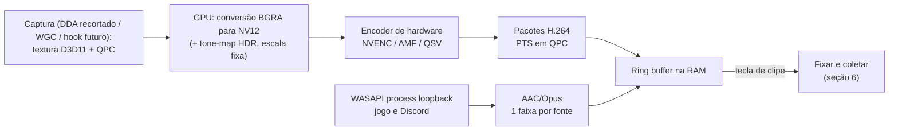
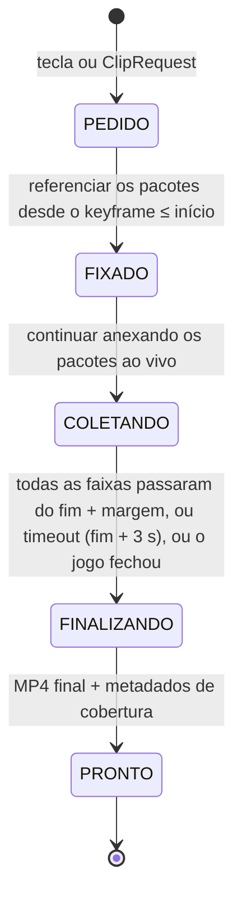
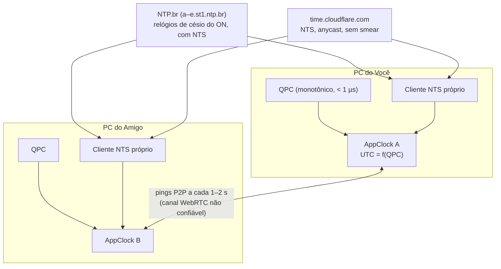
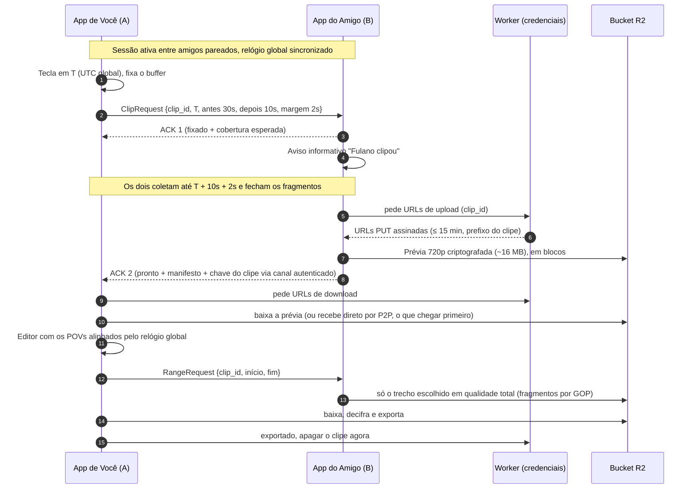

# App de clipes sincronizados entre amigos — Pesquisa e proposta de arquitetura

> **Nome provisório:** DuoClip · **Plataforma:** Windows 10/11 · **Versão:** 2 (08/10/2026)
>
> Objetivo: dois ou mais amigos jogam juntos, cada um com o app aberto. O app grava a tela do jogo
> de forma contínua e leve, como Medal, OBS e ShadowPlay. Quando acontece algo engraçado, um deles aperta
> a tecla de clipe e o app salva **a tela dos dois, sincronizada no tempo**, incluindo **alguns segundos antes e
> alguns segundos depois** do aperto. Em seguida abre uma prévia para escolher onde o clipe começa e termina.
> O app grava **só o jogo, o som do jogo e as vozes do Discord**.
>
> Evidências detalhadas sobre os métodos de captura do OBS e do Medal:
> **[anexo-metodos-de-captura-obs-medal.md](anexo-metodos-de-captura-obs-medal.md)**.

---

## 0. O que mudou nesta versão

| Pedido | O que foi feito | Onde |
|---|---|---|
| **Relógio global** dentro do app, em vez do relógio do computador | Criamos o **Relógio Global DuoClip**. Ele usa o contador de alta precisão do PC (QPC) como base e é sincronizado com servidores de hora atômica com NTS (NTP.br e Cloudflare). Durante a sessão, os PCs se refinam entre si. Todos os clipes de todos os participantes ficam na mesma linha do tempo (UTC). | [Seção 8](#8-relógio-global-do-duoclip) |
| Verificar a **gravação um pouco depois do momento do aperto** | Pesquisamos como OBS, Medal, Overwolf, Steam, NVIDIA e outros fazem. Desenhamos o mecanismo "fixar e coletar", com margens de segurança, valores padrão e uma tabela de casos de borda. | [Seção 6](#6-buffer-de-replay-e-gravação-além-do-aperto-pós-roll) |
| **Sistema de bucket** para os clipes temporários | Comparamos R2, S3 São Paulo, GCS, Supabase, B2 e Wasabi (preços oficiais, expiração e segurança). Recomendação: **Cloudflare R2 com criptografia ponta a ponta e expiração automática**, mais "buckets" locais em disco para os clipes em andamento. | [Seção 10](#10-rede-e-armazenamento-temporário-bucket) |
| **Decisão de captura** (08/10): sem injeção por padrão; hook como opcional futuro | Padrão: **captura sem injeção**, com Desktop Duplication recortado na janela do jogo no Windows 10, que é sem borda amarela (o mesmo método sem injeção do Medal). O **hook estilo Medal** fica previsto na arquitetura, como modo opcional para jogos sem anti-cheat, implementado numa fase posterior. | [Seção 4.5–4.8](#45-decisão-sem-injeção-por-padrão-hook-como-modo-opcional-futuro) |
| Verificar se **a gravação de tela é a mais eficaz** e o que **Medal e OBS usam** | Lemos o código-fonte do OBS e reunimos as evidências sobre o Medal: o suporte do próprio Medal, logs reais e análise do instalador. Resposta: os dois usam **por padrão um hook injetado no jogo**, e o **WGC aparece como opção** ("Modern (WGC)" no OBS, "Advanced Window Capture" no Medal). Para um app novo que precisa ser seguro com anti-cheat, o melhor é a **captura sem injeção** (veja a decisão acima). | [Seção 4](#4-captura-de-vídeo-o-que-obs-e-medal-usam-e-qual-é-o-mais-eficaz) e [anexo](anexo-metodos-de-captura-obs-medal.md) |

---

## Sumário

0. [O que mudou nesta versão](#0-o-que-mudou-nesta-versão)
1. [Resumo da recomendação](#1-resumo-da-recomendação)
2. [Requisitos](#2-requisitos)
3. [O que já existe no mercado](#3-o-que-já-existe-no-mercado)
4. [Captura de vídeo: o que OBS e Medal usam e qual é o mais eficaz](#4-captura-de-vídeo-o-que-obs-e-medal-usam-e-qual-é-o-mais-eficaz)
5. [Codificação por hardware](#5-codificação-por-hardware)
6. [Buffer de replay e gravação além do aperto (pós-roll)](#6-buffer-de-replay-e-gravação-além-do-aperto-pós-roll)
7. [Áudio: só o jogo + Discord](#7-áudio-só-o-jogo--discord)
8. [Relógio global do DuoClip](#8-relógio-global-do-duoclip)
9. [Fluxo completo de um clipe](#9-fluxo-completo-de-um-clipe)
10. [Rede e armazenamento temporário (bucket)](#10-rede-e-armazenamento-temporário-bucket)
11. [Editor / pré-visualização](#11-editor--pré-visualização)
12. [Segurança e privacidade](#12-segurança-e-privacidade)
13. [Stack tecnológica](#13-stack-tecnológica)
14. [Distribuição e requisitos mínimos](#14-distribuição-e-requisitos-mínimos)
15. [Roadmap](#15-roadmap)
16. [Riscos e mitigação](#16-riscos-e-mitigação)
17. [Fontes](#17-fontes)

---

## 1. Resumo da recomendação

| Tema | Decisão | Por quê |
|---|---|---|
| Captura de vídeo | **Sem injeção por padrão:** Desktop Duplication recortado na janela do jogo no **Windows 10, sem borda amarela**; WGC sem borda ou o mesmo método no Windows 11. **Hook estilo Medal** como modo opcional **futuro**, só em jogos sem anti-cheat. | Seguro com qualquer anti-cheat e leve, porque a compressão é feita pelo chip de vídeo. O hook é o mais leve de todos, mas só é seguro em jogos sem anti-cheat, por isso fica opcional e para depois. |
| Codificação | Encoder de hardware (NVENC, AMF ou Quick Sync), com a imagem sempre na GPU | Todo gravador moderno faz assim. O impacto no FPS é mínimo. |
| Buffer | Fila circular **na RAM** de pacotes já codificados, com keyframe a cada 1 s e sem B-frames | Mesmo modelo do OBS. O corte do clipe sai em milissegundos, sem recodificar. |
| **Pós-roll** | **"Fixar e coletar"**: ao apertar, o trecho anterior é fixado no buffer, e o app continua gravando até T + depois + margem antes de fechar o clipe | Esperar e só então salvar não funciona, porque o começo do clipe já teria saído do buffer. O Medal (Game API) e o Overwolf fazem pós-roll desse jeito. |
| Áudio | WASAPI *process loopback*: jogo e Discord em faixas separadas | Grava só esses dois apps. O OBS e o Medal usam a mesma API. |
| **Relógio** | **Relógio Global DuoClip** = QPC disciplinado para UTC por um cliente **NTS** próprio (NTP.br + Cloudflare), com refino P2P durante a sessão | Não depende do relógio do Windows, que no PC doméstico sincroniza a cada ~9 h e pode dar saltos. Todos os clipes de todo mundo ficam na mesma linha do tempo. |
| **Armazenamento temporário** | **Bucket Cloudflare R2** com prefixo por clipe, expiração em ≤ 72 h, URLs assinadas curtas e **criptografia ponta a ponta**. P2P direto como acelerador. | Funciona com o amigo offline ou atrás de CGNAT. Para um grupo de amigos **cabe no plano gratuito (US$ 0)**. Mesmo com 1.000 usuários custaria ≈ US$ 2–4/mês, porque o R2 não cobra download. |
| Segurança | Sem injeção nos jogos protegidos por anti-cheat, sem driver, sem administrador. Só amigos pareados disparam clipes. Tudo criptografado. | É requisito do projeto. |
| Stack | Rust (núcleo) + Tauri 2 (interface) + WebRTC + Cloudflare Worker (credenciais e limpeza) | Desempenho, segurança de memória e backend mínimo. |

---

## 2. Requisitos

**Funcionais**

- **R1:** gravar continuamente a janela do jogo, em alta qualidade e com impacto mínimo no FPS.
- **R2:** gravar o áudio do jogo e as vozes do Discord. O microfone próprio é uma faixa opcional.
- **R3:** quando qualquer um aperta a tecla de clipe, o clipe é salvo **em todos os PCs da sessão**.
- **R4:** o clipe inclui *N* s antes e ***M* s depois** do aperto, com margens extras para o ajuste no editor.
- **R5:** todos os clipes ficam na **mesma linha do tempo global**.
- **R6:** prévia com os POVs, para escolher início, fim e layout.
- **R7:** funcionar com qualquer jogo, com GPUs NVIDIA, AMD e Intel, no Windows 10 22H2 e no Windows 11.
- **R8:** os clipes temporários trocados entre amigos ficam num **bucket** e são apagados automaticamente.

**Não funcionais**

- **Segurança:** sem injeção, sem admin, criptografia de ponta a ponta.
- **Privacidade:** só o jogo e o Discord. A captura do monitor inteiro só acontece como opção explícita.
- **Desempenho:** perda de FPS abaixo de 3–5%, a ser medida, e transferências que não pioram o ping.

---

## 3. O que já existe no mercado

Nenhuma ferramenta **dispara o clipe em vários PCs ao mesmo tempo com sincronia por relógio**:

| Produto | O que faz | Diferença |
|---|---|---|
| **Medal**: "Clips You're In" e tag de squad | Encontra clipes que *outros* fizeram e em que você aparece | Não grava a tela do amigo quando você aperta |
| **Allstar** | Renderiza clipes a partir do **demo** da partida (CS2, Dota 2, LoL, Fortnite) | Sincronia perfeita, mas não é a tela real, não tem voz do Discord e só funciona em jogos com demo |
| **MultiView Sync Player** e **VOD Review** | Alinham vídeos *depois*, pelo áudio ou manualmente | Cada um precisa gravar e enviar o próprio arquivo |
| **MultiPOV** | Junta lives e VODs (YouTube, Twitch, Kick) pelo som | Não usa arquivos locais |
| **Overwolf/Outplayed** | Clipes automáticos por evento, com segundos antes e depois | Só o seu POV |

> 💡 **Ideia extra:** para CS2 (e Dota 2), dá para oferecer um modo "sincronia perfeita" opcional que renderiza
> cada POV a partir do demo da partida, como o Allstar, e coloca por cima a voz gravada localmente usando o relógio global.

---

## 4. Captura de vídeo: o que OBS e Medal usam e qual é o mais eficaz

### 4.1 Métodos que existem no Windows

| Método | Como funciona | Custo para o jogo | Disponível para um app novo e seguro? |
|---|---|---|---|
| **Captura no driver** (NVIDIA NvFBC, AMD) | O driver copia o framebuffer direto para o encoder | O mais baixo | ❌ O NvFBC foi descontinuado e é restrito na GeForce (exige a chave da NVIDIA e admin). A API da AMD só captura o monitor inteiro. |
| **Hook injetado** (OBS "Game Capture", padrão do Medal) | Uma DLL dentro do jogo copia cada frame para uma textura compartilhada | Muito baixo | ⚠️ Só como **modo opcional futuro**, em jogos **sem anti-cheat**. É **injeção de código**: com anti-cheat só funciona para OBS e similares, que têm o **certificado** liberado. O próprio OBS avisa que o CS2 pode exigir `-allow_third_party_software` para o Game Capture funcionar. |
| **WGC de janela** (Windows.Graphics.Capture) | API oficial do Windows que entrega os frames da janela | Baixo | ✅ Sim. Não toca no jogo e pega só a janela, mas **no Windows 10 mostra borda amarela**. |
| **DXGI Desktop Duplication** (recortado na janela do jogo) | Copia o monitor já composto e recorta a área do jogo na GPU | Baixo–médio (a medir) | ✅ **Sim, e é o padrão no Windows 10:** sem borda e sem injeção. Cuidado: grava o que aparecer por cima do jogo (seção 4.6). |
| **BitBlt** | Cópia pela CPU (GDI) | Alto | ⚠️ Antigo e pesado para jogos |

### 4.2 O que o OBS usa (conferido no código-fonte)

- **Game Capture** é **injeção de DLL**: `graphics-hook64.dll` entra no jogo via `SetWindowsHookEx`, ou via `CreateRemoteThread`, e intercepta `Present`. A KB do OBS diz que é o método "mais eficiente".
- **Window Capture** tem os modos "Modern (WGC)" e "Legacy (BitBlt)". O **automático prefere BitBlt** e só escolhe WGC para navegadores, UWP e algumas classes de janela.
- **Display Capture** usa **DXGI Desktop Duplication** e muda para WGC em notebooks híbridos.
- Quando o jogo bloqueia o hook (Destiny 2, Roblox...), o próprio OBS manda **usar Window Capture (WGC)**.
- **Áudio por aplicativo:** *process loopback*, o mesmo que propomos.
- **Relógio:** QPC em tudo.
- **Replay buffer:** fila na RAM, **sem pós-roll**.

### 4.3 O que o Medal usa (pesquisa a fundo)

- O **padrão é um hook injetado derivado do OBS**:
  - o próprio suporte do Medal diz que *"injeta nos seus jogos para dar o overlay e capturar a gameplay"*;
  - logs reais de 2023 mostram `OBSInjectionState` e *offsets* no formato exato do OBS;
  - o recorder de 2026 ainda tem as classes `MedalEncoder.OBS.HookInterface` e `PreferGameCapture=true`.
- **"Advanced Window Capture" = WGC**: o comando interno é `set.windowsGraphicsCapture`, aparece a borda amarela e não funciona em fullscreen exclusivo. É **opcional**, e o Medal o recomenda para jogos como CS2.
- Também há uma captura de janela "padrão" baseada em DXGI e uma captura de tela inteira (Desktop Capture).
- Não há evidência de que o hook do Medal esteja na lista de liberados de nenhum anti-cheat. O próprio Medal lista o **FACEIT Anti-Cheat** como algo que interfere no hook.
- **Confiança:** alta para o padrão de 2023 e média para 2026. Os detalhes e o procedimento para confirmar estão no [anexo](anexo-metodos-de-captura-obs-medal.md#2-medal-pesquisa-a-fundo).

### 4.4 E os outros?

| Ferramenta | Método |
|---|---|
| NVIDIA ShadowPlay | NvFBC (driver) |
| AMD ReLive | Driver |
| Steam Game Recording | Provavelmente hook do overlay da Steam. Grava em disco e você escolhe o trecho depois. |
| Discord | DLL injetada por padrão, WGC como opção (deve virar padrão no Win11) |
| Overwolf / Outplayed | Motor baseado no OBS (game capture) |
| SteelSeries Moments | "Game Capture (WGC)" no Windows 11 |
| Allstar / Eklipse | Não gravam localmente (demo e VOD na nuvem) |

### 4.5 Decisão: sem injeção por padrão, hook como modo opcional futuro

> **Decidido em 08/10/2026:** o padrão é a captura **sem injeção**. O hook no estilo Medal fica **previsto na arquitetura**, mas é **implementado numa fase posterior**, como modo opcional.

| Modo | Quando | Por quê |
|---|---|---|
| **Padrão: sem injeção** | Sempre, em qualquer jogo, desde o MVP | O app não encosta no jogo, então não há risco com anti-cheat e o jogo não trava por causa do app. A parte pesada (comprimir o vídeo) é feita pelo chip de vídeo da placa, igual ao Medal. |
| **Opcional: hook injetado** (como o padrão do Medal) | Fase futura, só em jogos **sem anti-cheat**, ligado pelo usuário jogo a jogo | É o mais leve possível e funciona em tela cheia exclusiva, mas é código dentro do jogo. Um app novo não tem a "liberação" que OBS e Medal têm nos anti-cheats. |

Os métodos mais leves que existem (driver e hook) não servem como padrão para nós:

- o NvFBC da NVIDIA é restrito e foi descontinuado;
- o hook exige uma exceção nos anti-cheats que só OBS e similares têm. Até o OBS teve problemas quando trocou o certificado na versão 31.

Não existe benchmark independente comparando os métodos em FPS. Por isso vamos medir com **PresentMon** na Fase 0 (CS2, Valorant, Fortnite, LoL, Minecraft e Roblox, em hardware médio do Brasil).

### 4.6 Modo padrão: qual captura sem injeção em cada Windows

| Windows | Método padrão | Borda amarela | Observação |
|---|---|---|---|
| **Windows 10** | **Desktop Duplication recortado na janela do jogo** | **Não** | É o mesmo método sem injeção que o Medal usa na captura de janela "padrão" (os logs mostram `Capture mode: DXGI` e um retângulo de captura). |
| **Windows 11** | WGC sem borda, se o teste de empacotamento confirmar (4.10); senão, o mesmo Desktop Duplication recortado | Não | O WGC grava só a janela, mesmo com algo por cima. |

> ✅ **Confirmado pela pesquisa da rodada 3 (08/10/2026):**
> - **No Windows 10 não existe forma documentada de tirar a borda do WGC.** `IsBorderRequired` e `RequestAccessAsync(Borderless)` são do contrato v12 (build 20348+). No 19045, chamar `IsBorderRequired` dá `E_NOINTERFACE`, então **sempre** é preciso detectar a API antes (`ApiInformation.IsPropertyPresent`).
> - A borda também aparece capturando o monitor via WGC. A configuração do Windows para desligá-la só existe no Windows 11. Remover a borda no Win10 exigiria mexer no `dwm.exe` (admin/injeção), o que está **fora de questão**.
> - **O Medal não mostra borda no Win10 porque não usa WGC por padrão:** onde pode, injeta o hook; onde não pode (ex.: Roblox), usa a "WindowCaptureStandard", que é **Desktop Duplication recortado na janela**, com a imagem `inactiveGame.png` quando o jogo perde o foco. É exatamente o nosso padrão.
> - OBS (Display Capture automático), Sunshine (`ddx`) e Magpie também usam Desktop Duplication por padrão.
> - O *DWM shared surface* (`DwmGetDxSharedSurface`, não documentado) fica só como **backend experimental por jogo**: falha em janelas sem *redirection surface* e em DirectComposition, e pode quebrar com atualizações do Windows. BitBlt/PrintWindow não servem para jogos acelerados por hardware.
> - Ainda falta medir (PresentMon) se uma sessão de Desktop Duplication tira o jogo do *independent flip*/MPO no Windows 10.

**Por que o Medal "não laga" (logs e configurações reais) e o que vamos copiar:**

| Medal faz | DuoClip |
|---|---|
| Imagem só na GPU (textura do hook ou duplicação + recorte na GPU) | ✅ Igual: recorte com `CopySubresourceRegion` direto para o conversor NV12 e o encoder |
| Encoder de hardware (`a264hw`) | ✅ Igual (NVENC, AMF ou QSV) |
| Buffer de pacotes na RAM (~180 MB para 120 s a 10 Mbps) | ✅ Igual (seção 6) |
| Padrões modestos (720p60, 10–15 Mbps, VFR) | ✅ Padrão sugerido 1080p60 ou 720p60, 10–20 Mbps, preset de baixa latência |
| Processo do gravador em prioridade alta; `SetMaximumFrameLatency`; MMCSS | ✅ Igual: prioridade *above normal/high*, `SetMaximumFrameLatency` no nosso device, MMCSS nas threads de captura, encode e áudio |
| Tenta prioridade de GPU *realtime* (falha sem admin) | ❌ Não: exige admin e há travamentos conhecidos com NVIDIA + HAGS |
| **Desliga o Modo de Jogo do Windows** sem avisar | ❌ Não mexer nas configurações do PC dos amigos |
| Usa *dirty rects* para pular quadros sem mudança | ✅ `GetFrameDirtyRects`/`GetFrameMoveRects` cruzados com o retângulo do jogo, ou repetir o quadro anterior (CFR) |

**Cuidados com o Desktop Duplication recortado:**

- **Nossas próprias janelas** (aviso "Fulano clipou", prévia) recebem `SetWindowDisplayAffinity(WDA_EXCLUDEFROMCAPTURE)` (Win10 2004+) para nunca entrarem no recorte.
- `E_ACCESSDENIED` (UAC, tela de bloqueio): pausar e gravar a tela "jogo fora de foco". `DXGI_ERROR_NOT_CURRENTLY_AVAILABLE`: o limite de **4 processos duplicando ao mesmo tempo** foi atingido; avisar o usuário.
- O jogo pode mudar de monitor: acompanhar com `SetWinEventHook` (foreground, location, destroy, reorder) e recriar a duplicação no monitor novo.

- **Ele grava o que aparecer por cima do jogo** (uma notificação, um popup do Discord). Quando o jogo perde o foco, o app grava uma tela "jogo fora de foco" no lugar, como o Medal faz. A detecção usa `SetWinEventHook(EVENT_SYSTEM_FOREGROUND)`, que funciona de fora do processo, sem injeção.
- O app acompanha a posição e o tamanho da janela do jogo para ajustar o recorte. O recorte é feito na GPU (`CopySubresourceRegion` direto na textura de entrada do encoder).
- Quando o modo de tela muda, a duplicação precisa ser recriada (`DXGI_ERROR_ACCESS_LOST`).
- A duplicação roda na GPU dona do monitor. Em notebook híbrido, isso exige uma cópia GPU→GPU ou codificar na GPU integrada.
- O cursor não entra na imagem, o que é bom para jogos.

**Ordem de fallback:**

1. o método padrão da tabela acima;
2. WGC de janela (no Windows 10, com borda), se o Desktop Duplication falhar, por exemplo com o jogo num monitor de outra GPU;
3. pedir "tela cheia sem bordas" quando a tela cheia exclusiva der problema;
4. **banco de dados de jogos** atualizável remotamente (o Medal faz isso), com o método que funciona em cada título.

### 4.7 Modo hook (opcional, implementação futura)

- **O que é:** uma DLL no estilo do Medal e do OBS, carregada dentro do jogo, que copia cada frame direto para uma textura compartilhada. É o método mais leve, não tem borda e funciona em tela cheia exclusiva.
- **Conclusão da pesquisa (rodada 3):** **fora do MVP.**
  - Dos jogos populares no Brasil, **só o Minecraft** (Java; Bedrock a testar) não tem anti-cheat no cliente. Em todos os outros, e também na Gamers Club e na FACEIT, um módulo desconhecido é bloqueado, derruba da partida ou pode dar ban.
  - VAC já baniu por hook inofensivo: o AMD Anti-Lag+ no CS2, em 2023.
  - O próprio Medal diz que não lê nem modifica a memória do Valorant e usa APIs gráficas padrão. Ou seja, nos jogos protegidos ele também grava sem injetar.
  - O hook só vale a pena se o benchmark no Minecraft mostrar ganho claro, por exemplo gravar mesmo com o jogo coberto ou minimizado.
  - A tabela completa por jogo está no [anexo](anexo-metodos-de-captura-obs-medal.md#5-anti-cheat-por-jogo-rodada-3).
- **Regras de uso:**
  - **desligado por padrão**, e o usuário liga **jogo a jogo**;
  - só pode ser ligado em jogos marcados como **"sem anti-cheat"** no banco de jogos (por exemplo Minecraft e jogos single-player);
  - **bloqueado** em jogos com Vanguard, Easy Anti-Cheat, BattlEye, VAC/CS2, FACEIT, Gamers Club, Ricochet, Hyperion (Roblox) etc.;
  - se o hook falhar ou o jogo atualizar, o app volta sozinho para o modo sem injeção;
  - **lista de bloqueio fixa**, que o usuário não pode mudar: CS2, Dota 2, Valorant, LoL, Fortnite, Apex, Rust, R6, PUBG, GTA V, FiveM, CoD/Warzone, Marvel Rivals, EA FC, Rocket League (EAC desde 28/04/2026), Roblox e emuladores Android (Free Fire);
  - o hook se **desliga sozinho, até em jogos liberados,** sempre que um anti-cheat de kernel ou de plataforma estiver rodando no PC (Vanguard, FACEIT, Gamers Club, EAC, BattlEye, Javelin, Ricochet, Hyperion);
  - **nunca** usar hooks globais nem uma *layer* Vulkan implícita sempre ativa. Se precisar de Vulkan, restringir com `enable_environment` só aos processos liberados;
  - *kill switch* remoto no banco de jogos e telemetria de crash entre os amigos.
- **Entrega:**
  - componente **separado** (`duoclip-hook`), assinado digitalmente. Assim o app principal não carrega nenhum código de injeção enquanto o modo estiver desligado;
  - se for derivado do *graphics-hook* do OBS, ele é GPL-2. Nesse caso, distribuir como componente separado com o código-fonte disponível, como o Medal faz. A outra opção é escrever do zero.
- **O que já fica pronto agora para ele encaixar depois:**
  - a interface comum de captura (4.8);
  - os campos de anti-cheat e de métodos permitidos no banco de jogos;
  - os timestamps em QPC iguais aos dos outros métodos.

### 4.8 Arquitetura: métodos de captura plugáveis

Todo método de captura entrega a mesma coisa ao resto do app: uma **textura na GPU** e o **horário QPC** do frame. Encoder, buffer, pós-roll e relógio global não sabem qual método está em uso.

```rust
/// Implementado por cada método: "dda_crop", "wgc" e, no futuro, "hook".
pub trait CaptureBackend {
    fn id(&self) -> BackendId;
    fn injects_into_game(&self) -> bool;          // true só no hook
    fn supports(&self, target: &GameTarget) -> Support;
    fn start(&mut self, target: &GameTarget, sink: FrameSink) -> Result<()>;
    fn stop(&mut self);
}

pub struct CapturedFrame {
    pub texture: ID3D11Texture2D, // já na GPU, vai direto para conversão de cor + encoder
    pub qpc_100ns: i64,           // horário no relógio local (QPC)
    pub content_rect: Rect,       // área do jogo dentro da textura
    pub game_focused: bool,       // false => grava a tela "jogo fora de foco"
}
```

Escolha do método para cada jogo:

```text
jogo  = banco_de_jogos[exe]
pedido = configuração do usuário para esse jogo (ou o padrão do banco)
se pedido == hook e (jogo.anticheat != "nenhum" ou hook não instalado):
    pedido = padrão_sem_injeção(versão do Windows)
se pedido falhar ao iniciar:
    tentar o próximo da ordem de fallback (4.6)
```

Campos do banco de jogos: `exe`, `nome`, `anticheat` (ex.: `vanguard`, `eac`, `battleye`, `vac`, `nenhum`), `metodos_permitidos`, `metodo_padrao`, `observacoes` (ex.: "pedir tela cheia sem bordas").

### 4.9 Configuração do WGC (quando usado)

- Usar `Direct3D11CaptureFramePool.CreateFreeThreaded`, com 2–3 buffers numa thread dedicada. Passar o frame **direto** para a conversão de cor e o encoder, evitando a cópia extra que o OBS admite fazer.
- Configurar e medir `MinUpdateInterval` (Win11 24H2+). Sem ele, há relatos de captura limitada a ~50–60 fps.
- No Windows 11 24H2, o WGC pode parar de entregar frames quando a imagem não muda. Nesse caso, repetir o último frame para manter a taxa constante.
- `IsCursorCaptureEnabled(false)` em jogos (a mira é desenhada pelo próprio jogo).
- Timestamp de cada frame: `SystemRelativeTime` (QPC). É o momento da **composição pelo DWM**, então é preciso **calibrar o atraso áudio/vídeo** por fonte (um teste mediu de 18 a 44 ms). O mesmo vale para o Desktop Duplication.
- Respeitar janelas protegidas (`WDA_EXCLUDEFROMCAPTURE`). Jogos rodando como admin só podem ser capturados se o app também rodar como admin, e a interface deve avisar.
- **HDR:** detectar o espaço de cor com `IDXGIOutput6::GetDesc1`, capturar em FP16 e aplicar *tone-mapping* para SDR na GPU. O Medal tem um "HDR Compatibility" justamente por causa de clipes estourados.
- **Mudança de resolução** (alt-enter): codificar numa **resolução de saída fixa**, escolhida no início da sessão e escalada na GPU, para o encoder não reiniciar no meio de um clipe.

### 4.10 Borda amarela e empacotamento

- No WGC, remover a borda exige o **build 20348+**, ou seja, Windows 11. **No Windows 10 não há como tirar a borda do WGC** (confirmado: no 19045 a chamada dá `E_NOINTERFACE`), e é por isso que lá o padrão é o Desktop Duplication recortado.
- No Windows 11 o fluxo é `GraphicsCaptureAccess.RequestAccessAsync(Borderless)` (pede consentimento ao usuário) seguido de `IsBorderRequired(false)`. A Microsoft documenta que é preciso a capability `graphicsCaptureWithoutBorder` no **manifesto de pacote**. O OBS, que não é empacotado, chama a mesma API, mas **não está documentado** se a remoção funciona sem pacote.
- **Protótipo de 1 dia:** testar (a) app sem pacote, (b) sem pacote com a opção do Windows 11 ligada e (c) pacote esparso/MSIX com a capability. Se nenhuma funcionar sem complicação, o Windows 11 também usa o Desktop Duplication recortado.

---

## 5. Codificação por hardware



| Parâmetro | Valor | Observação |
|---|---|---|
| Codec | **H.264** (HEVC e AV1 opcionais) | Compatível com tudo (WebView2, WhatsApp, Discord) |
| Resolução / FPS | Saída fixa (nativa ou 1080p) a 60 fps | Evita reiniciar o encoder no meio de um clipe |
| Taxa | VBR ou CQP com teto (~30–50 Mbps em 1080p60) | Manter também um **limite em MB** no buffer |
| Keyframe | **1 s, GOP fechado** | Cortes com no máximo 1 s de folga |
| B-frames | **0** | Menor latência do encoder e corte final trivial |
| Prévia (proxy) | **Transcodificada sob demanda** a partir do trecho salvo (decode e encode em hardware) | Não manter uma segunda codificação contínua, porque o limite de sessões simultâneas de NVENC na GeForce é compartilhado com Discord e ShadowPlay |
| GPU sem encoder (RX 6500 XT/6400, GT 1030) | Usar o encoder da GPU integrada, se houver. Senão, x264 720p30 "superfast" com aviso. | Essas placas não têm encoder de hardware |
| Notebook híbrido | Codificar na GPU dona da imagem capturada, ou fazer uma cópia GPU→GPU explícita, conforme a medição | Evitar uma leitura escondida pela CPU |

O caminho mais prático é o **FFmpeg (libavcodec, build LGPL)** com `h264_nvenc`, `h264_amf` ou `h264_qsv` e frames D3D11. O FFmpeg 8.1 também tem o filtro `gfxcapture` (WGC), útil num protótipo rápido.

---

## 6. Buffer de replay e gravação além do aperto (pós-roll)

### 6.1 Como as ferramentas fazem

| Ferramenta | Grava depois do aperto? | Como |
|---|---|---|
| **OBS** | ❌ Não nativo | "Salvar" anota o instante (QPC) e corta quando o encoder entrega um pacote ≥ esse instante. Pós-roll só por scripts ou gambiarras. |
| **Medal** | ⚠️ O atalho manual não. **A Game API sim.** | `captureDelayMs` = *"ms que o Medal espera depois do pedido antes de tirar o snapshot do replay buffer"* |
| **Overwolf / Outplayed** | ✅ Sim | `capture(pastDuration, futureDuration)`, buffer na memória, uma captura por vez. O Outplayed tem controles de "segundos antes/depois" por evento. |
| **Steam** | ✅ Indiretamente | Grava continuamente em disco e você escolhe o trecho na linha do tempo depois. A Timeline API sugere clipes "um pouco antes e depois do evento". |
| NVIDIA, AMD, Xbox Game Bar, SteelSeries | ❌ Só o passado | Gravação longa ou marcadores |

### 6.2 Por que não dá para "esperar e salvar"

Um buffer de 60 s que espera M segundos para salvar **perde os primeiros M segundos** do trecho anterior, porque eles saem do buffer enquanto o app espera. Por isso, no instante do pedido, o trecho anterior precisa ser **fixado** (*pin*). É o que o OBS faz internamente ao salvar: ele pega referências contadas dos pacotes enquanto o buffer continua girando.

### 6.3 Máquina de estados "fixar e coletar" (igual nos dois PCs)



- **Fim da coleta:** quando **todas as faixas** (vídeo, áudio do jogo, Discord) emitiram pacotes com timestamp ≥ fim. É a regra do OBS (`sys_dts ≥ save_ts`) generalizada, e ela absorve automaticamente a latência do encoder.
- **Janela, no relógio global:**
  - `início = T − antes − margem`;
  - `fim = T + depois + margem`;
  - no relógio local, cada ponta ainda é alargada pela incerteza ε da sincronia;
  - o início é ajustado **para trás até o keyframe anterior**.
- **Keyframe forçado (opcional):** no aperto, forçar um IDR (NVENC `NV_ENC_PIC_FLAG_FORCEIDR` com `enablePTD=1`, AMF `ForcePictureType=IDR`, oneVPL `MFX_FRAMETYPE_IDR`). Assim os fragmentos dos dois PCs começam alinhados.

### 6.4 Valores padrão sugeridos

| Parâmetro | Padrão | Faixa |
|---|---|---|
| Antes do aperto | **30 s** | 10–120 s |
| **Depois do aperto** | **10 s** | 0 / 5 / 10 / 15 / 30 s |
| **Margem oculta** (folga para o editor) | **+2 s antes e +2 s depois**, alargada automaticamente para máx(2 s, 3ε) quando a sincronia está ruim | — |
| Corte inicial no editor | T−10 s → T+5 s | — |
| Ring buffer na RAM | 60 s (com teto de ~600 MB) | ≥ antes + margem + GOP + ~25 s de tolerância a atraso do pedido |
| Timeout de finalização | fim + 3 s | — |
| Duração máxima de um clipe (com extensões) | 180 s | — |
| Clipes ativos ao mesmo tempo | 4 | — |

### 6.5 Buckets locais em disco (crash-safe)

- Assim que um clipe é **fixado**, ele é gravado aos poucos, numa thread de baixa prioridade, em `%LOCALAPPDATA%\DuoClip\buckets\<clip_id>\`. O formato é **MP4 fragmentado** (um fragmento por GOP) mais um pequeno journal JSON.
  - Se o app travar ou o jogo fechar no meio do pós-roll, o arquivo continua tocável até o último fragmento (o FFmpeg documenta isso, e é o princípio do "Hybrid MP4" do OBS).
  - Depois que um fragmento está no disco, a referência na RAM é liberada, então pós-rolls longos não enchem a memória.
- **Modo opcional "histórico longo"** (estilo Steam): um ring **em disco** de segmentos de 10 s, com 10–30 min de histórico.
  - Custo: ~22,5 GB/h escritos no SSD a 50 Mbps, por isso é opção.
  - A pasta é apagada ao sair e ao iniciar, e é criptografada, porque contém a voz dos amigos.
- Esses mesmos fragmentos são a unidade enviada ao **bucket na nuvem** ([seção 10](#10-rede-e-armazenamento-temporário-bucket)).

### 6.6 Casos de borda

| Situação | Comportamento |
|---|---|
| A mesma pessoa aperta de novo durante o pós-roll | **Estende** o clipe (mesmo `clip_id`, até 180 s) e envia `ClipExtend` ao amigo |
| Os dois apertam quase juntos | Dois `clip_id`s que **compartilham** os pacotes fixados (sem duplicar RAM). A interface oferece "juntar". |
| O pedido chega atrasado no amigo | O amigo fixa ao receber, se o buffer ainda cobre o início (tolerância de ~27 s com os padrões), e finaliza no fim ou imediatamente se o fim já passou |
| O buffer do amigo não cobre mais o início (ou ele acabou de entrar) | **Clipe parcial** com metadados de cobertura. O editor mostra "sem imagem do amigo" na lacuna. |
| A conexão cai antes da confirmação | Quem pediu guarda o pedido e reenvia ao reconectar. O amigo ignora duplicatas pelo `clip_id`. |
| O jogo fecha durante o pós-roll | Finaliza antes da hora e marca `truncated_by_source_end` |
| O app trava no pós-roll | O bucket local e o journal sobrevivem. Ao reiniciar, o app finaliza como parcial e avisa o amigo. |
| Jogo minimizado ou fora de foco | Desktop Duplication: grava a tela "jogo fora de foco". WGC: repete o último frame ou usa o timeout. O áudio continua. |
| Driver da GPU reinicia | Fecha o fragmento, registra a lacuna e reinicia o encoder com IDR |
| Sincronia ainda não convergiu | Margens alargadas automaticamente e aviso de "sincronia de baixa confiança" |
| Disco cheio | Mantém o clipe só na RAM e avisa. Nunca trava a captura. |
| Tecla apertada sem jogo aberto | Avisa localmente. O pedido ao amigo vai marcado `requester_no_source`, para ele ainda salvar o POV dele. |

---

## 7. Áudio: só o jogo + Discord

- **API:** `ActivateAudioInterfaceAsync` com `AUDIOCLIENT_ACTIVATION_TYPE_PROCESS_LOOPBACK` e `PROCESS_LOOPBACK_MODE_INCLUDE_TARGET_PROCESS_TREE`. É **exatamente o que OBS e Medal usam**.
- **Versão:** a Microsoft documenta o build 20348+, mas o OBS ativa a partir do 19041. Os logs do Medal no Windows 10 19045 mostram **falhas intermitentes**. Por isso: tentar ativar, repetir em caso de falha e, como último recurso, cair para o loopback do dispositivo com aviso.
- **Faixas:**
  1. jogo (PID da janela capturada);
  2. Discord (processo **raiz** de `Discord.exe`, `DiscordPTB.exe` ou `DiscordCanary.exe`, com a árvore de processos);
  3. microfone (opcional, desligado por padrão).

  O Medal 2026 já separa o áudio por processo do mesmo jeito (jogo, Discord.exe).
- **Vozes:** o Discord não toca a sua própria voz para você. A sua voz só aparece na gravação do amigo, com o atraso do Discord. Regras para o editor:
  - com o mic de cada um gravado, usar os mics (sincronia perfeita pelo relógio global);
  - sem mic, usar a faixa do Discord de cada PC e **compensar o atraso**, medido por correlação cruzada quando houver mic;
  - **nunca** tocar a mesma voz duas vezes;
  - com 3 ou mais amigos, uma faixa do Discord fica como "mestre" e as outras ficam abaixadas.
- **Timestamps:** `GetBuffer` devolve QPC em unidades de 100 ns, o mesmo relógio do vídeo. Ainda assim, é preciso calibrar o atraso por fonte e medir se o QPC é válido no modo *process loopback*, que a Microsoft só documenta de forma genérica.

---

## 8. Relógio global do DuoClip

> **Pedido:** usar um relógio global sincronizado dentro do app, em vez do relógio do computador, para todos os clipes.

### 8.1 Por que não usar o relógio do Windows

- Num PC doméstico (fora de domínio), o Windows sincroniza com `time.windows.com` **mais ou menos a cada 9,1 h** (`MaxPollInterval = 2^15 s`, desde o build 1703).
- Ele **dá saltos** quando a diferença passa de 1 s (`MaxAllowedPhaseOffset = 1 s`).
- A própria Microsoft diz que a configuração padrão serve para "hora aproximada". Precisão de 50 ms ou 1 ms exige configuração especial e rede local, condições que o usuário doméstico não tem.
- O *Secure Time Seeding* do Windows já foi relatado colocando datas absurdas. O usuário também pode mudar a hora na mão.
- Um cristal de PC livre deriva **±10 ppm = ±36 ms por hora**.

**Conclusão:** o app **nunca** usa o relógio do Windows para sincronizar. Ele também **não altera** o relógio do Windows, então não precisa de admin.

### 8.2 Arquitetura: QPC + NTS + P2P



- **Base local:** QPC. É monotônico, imune a mudanças de hora, fuso e horário de verão, conta durante o sleep e é o relógio nativo do WGC e do WASAPI.
- **Escala global:** **UTC em nanossegundos**. O `AppClock(q) = ref_utc + (q − ref_qpc) · (1e9/QPF) · (1 + desvio)` é estimado continuamente (offset **e** frequência).
- **Fontes:** um **cliente NTS próprio** dentro do app. O NTS (RFC 8915) autentica o servidor via TLS 1.3 e protege os pacotes, o que impede alguém de falsificar a hora.
- **Refino P2P:** durante a sessão, os PCs trocam pings estilo NTP (4 timestamps em QPC) num canal WebRTC `ordered:false, maxRetransmits:0`. As duas estimativas são combinadas, e o app avisa se elas discordarem.

**Por que híbrido:**

- Com dois PCs sincronizados ao mesmo servidor, o erro relativo é ≤ δA/2 + δB/2, onde δ é o tempo de ida e volta até o servidor.
- Medindo direto entre os PCs, o erro é ≤ δAB/2.
- O global ganha quando os amigos estão em cidades diferentes e perto de um servidor. O P2P ganha quando estão na mesma cidade ou operadora.
- O híbrido também é a única opção que **continua funcionando** se uma das partes falhar: porta UDP 123 bloqueada, ou o amigo que serviria de referência sair da sessão.

### 8.3 Fontes de tempo

| Fonte | Usar? | Motivo |
|---|---|---|
| **NTP.br** (`a`–`e.st1.ntp.br`; `c.st1` e `gps.ce.ntp.br` em Fortaleza) | ✅ Principal | Estrato 1 ligado aos relógios de césio do Observatório Nacional. O NIC.br diz (2026) que **todos os servidores NTP.br operam com NTS**. |
| **time.cloudflare.com** | ✅ Principal | NTS (TCP 4460), anycast, **sem leap smear** |
| Google / AWS | ❌ | Fazem *leap smear*, e misturar fontes com e sem smear causa erro de até 0,5 s em segundos intercalares |
| time.windows.com | ❌ | Sem NTS. Há medições de servidores da Microsoft até 50 ms fora por horas. |
| pool.ntp.org | ❌ como padrão | Sem NTS, e a política do pool proíbe embutir os nomes padrão num app |
| Roughtime | Só como checagem grosseira | Resolução de 1 s |

Regras de uso: rajada de 4–8 consultas ao iniciar, depois uma consulta a cada 64 s por fonte, **nunca mais de uma a cada 15 s**. Respeitar respostas de "reduza a taxa" (KoD) e **falar com NIC.br e Cloudflare** antes de distribuir em massa.

### 8.4 Estimador e incerteza

```ts
// Para cada fonte (servidor NTS ou amigo P2P), guardar ~64 amostras:
// t1, t4 = QPC local na ida e na volta; t2, t3 = horário do servidor/amigo
function amostra(t1, t2, t3, t4) {
  const rtt    = (t4 - t1) - (t3 - t2);          // ida e volta na rede
  const offset = ((t2 - t1) + (t3 - t4)) / 2;    // diferença de relógio
  return { quando: t4, rtt, offset };
}

function estimar(amostras) {
  // 1) Filtrar: RTT > 150 ms, RTT > 3× o mínimo, ou fora dos 25% de menor RTT
  //    ("pacotes sortudos", com menos fila e menos assimetria).
  const boas = filtrarPorRtt(amostras, { max: 150, fator: 3, quantil: 0.25 });
  // 2) Regressão linear ponderada: offset(q) = a + b·q
  //    (b = desvio de frequência em ppm; ±10 ppm = ±36 ms/h).
  const { a, b, sigma } = regressaoPonderada(boas);
  // 3) Limite honesto de erro.
  const bound = Math.min(...boas.map(s => s.rtt)) / 2 + distanciaRaizDoServidor + 2 * sigma;
  return { a, b, bound, sigma };
}
// Combinar fontes: interseção de intervalos (estilo Marzullo) + média ponderada
// pela variância, exigindo ≥ 2 fontes NTS concordando.
// O relógio ao vivo só é corrigido aos poucos (slew), NUNCA volta para trás.
```

- **Estados:**
  - SINCRONIZADO: limite ≤ 8 ms;
  - DEGRADADO;
  - HOLDOVER: sem fontes, extrapola com a última frequência e a incerteza cresce com o tempo;
  - SEM SINCRONIA.
- **Persistência:** a frequência estimada é salva por máquina, como o *driftfile* do chrony, para o app convergir rápido no próximo início. Depois de sair do sleep ou trocar de rede, o app faz nova rajada.
- **Segundos intercalares:** nenhum previsto até pelo menos junho de 2027 (IERS Bulletin C 72), e a abolição está planejada até 2035. O relógio do app fica contínuo e o deslocamento UTC−TAI vai nos metadados.

### 8.5 Janela congelada × alinhamento refinado

Isso concilia as duas abordagens que a pesquisa encontrou:

1. **Para escolher a janela de captura:** cada PC usa o mapeamento **congelado no instante do pedido**. Uma correção posterior não "mexe" num clipe em andamento. As margens de 2 s absorvem o erro.
2. **Para alinhar os POVs no editor:** o app recalcula o mapeamento daquele intervalo com uma **regressão de dois lados**, usando amostras de antes **e depois** do clipe. É o maior ganho de precisão possível, e o resultado é gravado nos metadados.

O aperto é enviado como **timestamp global** (`hotkey_utc_ns`), não como "agora". Por isso o atraso de entrega da mensagem não importa.

### 8.6 Metas de precisão

| Indicador | Meta |
|---|---|
| Diferença entre dois PCs (fibra/cabo), P95 | **≤ 16,7 ms (1 frame a 60 fps)**, idealmente ≤ 8 ms |
| Cor no lobby | 🟢 ≤ 8 ms · 🟡 ≤ 33 ms · 🔴 acima disso ou HOLDOVER |
| Expectativa (estimada, sem medição publicada no Brasil) | 1–5 ms em fibra cabeada, alguns ms a mais em Wi-Fi, 5–50 ms em 4G |

### 8.7 Metadados de cada clipe (JSON ao lado do vídeo e no MP4 `prft`)

```json
{
  "clip_id": "uuid", "session_id": "uuid", "participant_id": "uuid",
  "timescale": "utc_posix_ns", "clock_epoch_id": 3,
  "hotkey_utc_ns": 1791460800123456789,
  "start_utc_ns": 1791460768123456789, "end_utc_ns": 1791460812123456789,
  "uncertainty_bound_ns": 3200000, "sync_state": "SYNCED",
  "qpc_frequency": 10000000, "start_qpc": 123456789012,
  "mapping": { "ref_qpc": 123456000000, "ref_utc_ns": 1791460700000000000, "rate_ppb": -4120, "method": "two_sided" },
  "sources": [{ "host": "a.st1.ntp.br", "nts": true, "min_rtt_us": 7400 }, { "host": "time.cloudflare.com", "nts": true, "min_rtt_us": 9100 }],
  "peer_offsets": [{ "peer_id": "uuid", "offset_ns": 1200000, "bound_ns": 2500000, "path": "direct" }],
  "av_offset_ms": { "video": -21, "game_audio": 0, "discord": 0 },
  "coverage": [{ "from_utc_ns": 1791460768123456789, "to_utc_ns": 1791460812123456789 }],
  "utc_tai_offset_s": 37
}
```

### 8.8 Limite físico: o netcode do jogo

Mesmo com relógios perfeitos, cada jogador **vê o mesmo evento em momentos diferentes**, porque o jogo interpola (no Source, cerca de 100 ms no passado por padrão, variando por cliente e jogo). Por isso o editor mostra a incerteza e oferece **ajuste fino** (±1 frame, ±1 ms) e alinhamento por áudio opcional.

### 8.9 Implementação (Rust)

| Crate | Licença | Uso |
|---|---|---|
| `ntp-proto` 1.9.0 (do ntpd-rs) | Apache-2.0 OR MIT | NTS-KE, pacotes, filtro de Kalman. A API é instável: fixar em `=1.9.0`. |
| `rkik-nts` 1.4.0 | MIT | Cliente NTS de alto nível, mas lê `SystemTime::now()` (relógio do Windows). Precisa de um **fork** para usar QPC. |
| `sntpc` 0.11 | MIT OR Apache-2.0 | SNTP sem NTS, com gerador de timestamp customizável (QPC). Serve de fallback. |

O estimador e a disciplina do relógio (algumas centenas de linhas) são escritos em casa. Mais tarde, opcionalmente, uma VM em São Paulo com chrony ou ntpd-rs como servidor NTS próprio, para fallback e telemetria. **Não** dá para fazer isso em Cloudflare Workers, que não têm UDP.

### 8.10 Validação

- **Teste do flash:** os dois PCs mostram um quadrado que pisca nas viradas de segundo do relógio global, com bipe. Os dois gravam, e o editor mede a diferença real de ponta a ponta.
- **Telemetria anônima opcional:** RTT mínimo, limite de erro, tipo de conexão e discordância global × P2P, para obter números reais do Brasil, que não existem publicados.

---

## 9. Fluxo completo de um clipe



---

## 10. Rede e armazenamento temporário (bucket)

> **Confirmado:** "bucket" = **armazenamento de objetos na nuvem** para trocar os clipes temporários.
> Os "buckets" locais em disco (seção 6.5) são só o armazenamento dos clipes em andamento em cada PC.

### 10.1 Pareamento e conexão

- **Identidade:** chaves Ed25519 por instalação, guardadas com DPAPI. Pareamento por código de convite e, opcionalmente, um código curto de verificação.
- **WebRTC DataChannel** com três canais:
  - `controle`: confiável e ordenado;
  - `relógio`: não confiável e não ordenado;
  - `dados`: acelerador P2P.
- **Signaling** pequeno (o mesmo Worker).
- Com o bucket, **o TURN deixa de ser necessário para transferir arquivos**. Só seria preciso para o canal de controle e relógio em NATs muito restritivos, e nesse caso o controle pode passar pelo próprio Worker (WebSocket).

### 10.2 Recomendação: bucket primeiro, P2P como acelerador

| | Bucket primeiro (recomendado) | P2P primeiro |
|---|---|---|
| Amigo fechou o app ou ficou offline | ✅ O clipe já está no bucket | ❌ Perde |
| CGNAT ou NAT simétrico (comum no Brasil) | ✅ Sem TURN | ⚠️ Precisa de TURN (10–25% das conexões) |
| Quem envia termina rápido | ✅ | ❌ Depende de quem recebe estar online |
| Privacidade | ✅ Com criptografia ponta a ponta, o provedor só vê bytes cifrados | ✅ |
| Custo | **US$ 0** para um grupo de amigos (plano gratuito do R2) | Zero (fora o TURN) |

Quando os dois estão online e com caminho direto, a prévia também vai por P2P. Quem recebe pega cada bloco **de quem entregar primeiro**.

### 10.3 Comparação de provedores (preços oficiais conferidos em out/2026)

| Provedor | Armazenamento | Download (egress) | Expiração nativa | Região no Brasil |
|---|---|---|---|---|
| **Cloudflare R2** | US$ 0,015/GB-mês (10 GB grátis) | **Grátis** | Regras por dia (remoção em até ~24 h após vencer) | ❌ (só wnam/enam/weur/eeur/apac/oc). O "Local Uploads" (beta, sem custo) grava perto do cliente, mas não está confirmado se há ponto na América do Sul. |
| **AWS S3 sa-east-1** | US$ 0,0405/GB-mês | US$ 0,15/GB | Por dia (arredonda para a meia-noite UTC) | ✅ São Paulo |
| **Google Cloud Storage southamerica-east1** | US$ 0,035/GiB-mês | US$ 0,12/GiB | Por dia. **Atenção:** o *soft delete* de 7 dias vem ligado e é cobrado; desligar. | ✅ São Paulo |
| **Supabase Pro** | US$ 25/mês com 100 GB, depois US$ 0,0213/GB | 250 GB incluídos, depois US$ 0,09/GB | ❌ **Não há expiração de objeto atual**; precisa de pg_cron ou Edge Function chamando `remove()` | ✅ sa-east-1 |
| Backblaze B2 | ~US$ 6,95/TB-mês (não reconferido) | Grátis até 3× o armazenado (não reconferido) | ≥ 2 dias | ❌ |
| Wasabi | Cobrança mínima de 90 dias por objeto (relatado, não reconferido) | — | — | ❌ Não serve para arquivos de horas |

**Por POV enviado:** prévia de 44 s × 3 Mbps ≈ 16,5 MB, mais o trecho final de ~16 s × 30 Mbps ≈ 60 MB, ou seja, **≈ 75 MB**.

**Custo para o uso real (grupo de amigos):**

- Exemplo: 5 amigos e 100 clipes por mês no grupo. Cada clipe sobe o POV dos outros 4, ou seja, 4 × 75 MB = 300 MB por clipe.
- Volume: **30 GB enviados por mês**. Com retenção de 72 h, a média armazenada é 30 ÷ 30 × 3 ≈ **3 GB**.
- Isso fica dentro do **plano gratuito do R2**: 10 GB-mês de armazenamento, 1 milhão de uploads e 10 milhões de leituras por mês, e download sempre grátis. **Custo: US$ 0.** Mesmo um grupo de 10 amigos clipando muito continua grátis.

**Referência de escala** (se um dia abrir para mais gente): 1.000 usuários × 20 clipes/mês.

- Volume: 20.000 × 75 MB = 1,5 TB enviados e 1,5 TB baixados por mês. Média armazenada ≈ 150 GB-mês.

| Provedor | Cálculo | ≈ Total/mês |
|---|---|---|
| **R2** | (150 − 10) × 0,015 = US$ 2,10. ~220 mil PUT/GET cabem no plano grátis. Download grátis. | **US$ 2–4** |
| S3 São Paulo | 150 × 0,0405 + (1.500 − 100) × 0,15 + operações | ~US$ 218 |
| GCS São Paulo | 140 GiB × 0,035 + 1.397 GiB × 0,12 + operações | ~US$ 174 |
| Supabase Pro | 25 + (150 − 100) × 0,0213 + (1.500 − 250) × 0,09 | ~US$ 139 |

O custo é dominado pelo **download**, e o R2 não cobra download. Por isso o R2 é a escolha. Os provedores com servidor em São Paulo só valeriam a pena se fosse obrigatório manter os dados no Brasil.

### 10.4 Expiração automática

Nenhum provedor apaga **por hora** de forma nativa. Por isso:

1. **Exclusão explícita** quando o clipe é exportado ou descartado (`DeleteObject` é **grátis** no R2).
2. **Varredura de hora em hora** (Cron Trigger do Worker) com base num registro `{clip_id, expires_at}`. Isso garante as 24–72 h com precisão de hora.
3. **Regra de ciclo de vida** no prefixo `clips/` com expiração de 3 dias, mais `AbortIncompleteMultipartUpload` de 1 dia, como **rede de segurança**.

### 10.5 Upload e download sem expor chaves

- **Nunca** embutir chaves do bucket no app.
- Um **Cloudflare Worker** autentica o usuário, confere se ele é **par do clipe** e devolve uma de duas coisas:
  - **URLs pré-assinadas** PUT/GET de no máximo 15 min (o R2 aceita de 1 s a 7 dias para GET/HEAD/PUT/DELETE; não aceita POST de formulário), com o `Content-Type` assinado;
  - ou **credenciais temporárias** do R2 restritas ao prefixo do clipe. Elas são assinadas com a chave mestra **no servidor**, nunca no cliente.
- **Cotas por usuário:** bytes por dia, clipes ativos e tamanho máximo de bloco e de clipe (ex.: 120 s × 60 Mbps). Só o amigo pareado recebe URL de leitura.

### 10.6 Criptografia ponta a ponta

- Cada clipe tem uma **chave aleatória de 256 bits**. Cada bloco é cifrado com **AES-256-GCM**, com *nonce* único (prefixo aleatório + contador) e AAD = `clip_id|pov|qualidade|índice|é_último`. A AAD impede trocar, reordenar ou truncar blocos.
  - Alternativa pronta: libsodium `secretstream`.
- A chave vai **só para o amigo pareado**, pelo canal autenticado. A Cloudflare só armazena bytes cifrados.

### 10.7 Uma única unidade de transferência (P2P e bucket)

Os fragmentos fMP4 alinhados por GOP (seção 6.5) são agrupados em **blocos cifrados de ~4–8 MiB**, cada um um **objeto separado**:

```
clips/{pair_id}/{clip_id}/{pov}/{proxy|full}/{índice}.bin
clips/{pair_id}/{clip_id}/{pov}/manifest.bin   ← cifrado: bloco → faixa de tempo global, hashes
```

- Usar objetos separados, e não multipart, permite **baixar o bloco N enquanto o N+1 ainda sobe** (um objeto multipart só pode ser lido depois de completo, e o R2 exige partes de tamanho igual).
- O mesmo bloco pode vir pelo P2P ou pelo bucket. O pedido é idempotente por `(clip_id, índice)` e retomável.

### 10.8 Não atrapalhar o ping

- Limitar o upload a 30–50% da banda medida enquanto o jogo roda.
- **Prévia primeiro:** ~16,5 MB levam ≈ 6,6 s a 20 Mbps de upload.
- **Qualidade total só do trecho escolhido:** ~60 MB levam ≈ 24 s a 20 Mbps e ≈ 4,8 s a 100 Mbps.
- Opção "enviar a qualidade total quando a partida acabar". O Medal, por padrão, só sobe depois que o jogo fecha.

---

## 11. Editor / pré-visualização

- **Reprodução sincronizada** pelos timestamps globais. Um vídeo é o mestre, e os outros são corrigidos a cada frame (`requestVideoFrameCallback`). Para *scrubbing* com precisão de frame, usar WebCodecs desenhando num único canvas.
- **Linha do tempo:** marcador do aperto, faixa de incerteza da sincronia, regiões "sem imagem do amigo", formas de onda e alças de início e fim. A margem oculta de ±2 s fica disponível como folga.
- **Layouts:** lado a lado, empilhado 9:16 (TikTok, Shorts, Reels), PiP, cortes alternados, sequencial, ou **arquivos separados já sincronizados** (sem recodificar).
- **Mixer** com as regras de voz da seção 7. **Ajuste fino** de ±1 frame e ±1 ms por POV.
- **Exportação:** composição na GPU com encoder de hardware (FFmpeg `filter_complex` com `hstack`, `vstack` e `overlay`). Quando o corte não cai em keyframe, recodificar só o primeiro e o último GOP, ou usar edit list.

---

## 12. Segurança e privacidade

| Área | Medida |
|---|---|
| **Anti-cheat** | No modo padrão, nenhuma injeção de DLL, driver ou leitura de memória do jogo. O modo hook futuro fica desligado por padrão e é bloqueado em jogos com anti-cheat (seção 4.7). Mapear **todas** as chamadas que tocam o processo ou a janela do jogo (meta: nenhum handle além de `PROCESS_QUERY_LIMITED_INFORMATION`). Testar com uma build assinada em Vanguard, EAC, BattlEye, FACEIT e **Gamers Club AC**, e abrir contato com FACEIT e Gamers Club. |
| **Atalho** | `RegisterHotKey`, com o QPC registrado no `WM_HOTKEY`, mais Raw Input e XInput para controle. **Evitar hooks globais de teclado** (`WH_KEYBOARD_LL`), que parecem keylogger. Segundo análise de terceiros, o Medal usa `SetWindowsHookEx` para atalhos. |
| **Quem pode disparar clipes** | Só amigos **pareados entre si** e numa sessão "jogar juntos" ativa. O pareamento já vale como autorização, então não há tela de aprovação. Cada PC mostra um aviso informativo ("Fulano clipou") e registra o histórico. |
| **Escopo** | Só a janela do jogo e só o áudio do jogo e do Discord. Respeitar janelas protegidas. |
| **Dados** | Buffer só na RAM. Buckets locais criptografados e apagados. Bucket na nuvem cifrado de ponta a ponta, com expiração ≤ 72 h e botão "apagar meus clipes agora". |
| **Rede** | DTLS no WebRTC, chaves fixadas, URLs assinadas curtas, cotas, schema rígido de mensagens e *fuzzing*. |
| **Código** | Rust no núcleo. FFmpeg LGPL atualizado. **Não copiar código do OBS** (GPL) para dentro do app: reimplementar os padrões. Um hook derivado do OBS só pode vir como componente separado com código-fonte disponível. |
| **Jurídico** | Uso privado entre amigos, então não há exigências adicionais neste plano. Se um dia o app for aberto ao público, revisar LGPD e ECA Digital (Lei 15.211/2025) antes. |

---

## 13. Stack tecnológica

| Camada | Escolha | Observação |
|---|---|---|
| Núcleo (captura, encoder, buffer, relógio) | **Rust** + `windows-rs` + FFmpeg (`ffmpeg-next`/`rsmpeg`, build LGPL) | Desktop Duplication e WGC via `windows-rs` (`windows-capture` como referência para o WGC) |
| Relógio global | `ntp-proto` / fork do `rkik-nts` + estimador próprio | Seção 8.9 |
| Interface e editor | **Tauri 2** (WebView2) + TypeScript (React ou Svelte) | WebCodecs para o editor |
| Rede P2P | `webrtc-rs` ou `libdatachannel` (MPL 2.0) | — |
| Backend mínimo | **Cloudflare Worker** (auth, URLs assinadas, signaling, varredura cron) + **R2** + D1/KV (registro de clipes) | Sem conteúdo em claro no servidor |
| Alternativa rápida para um MVP open source | libobs (GPL-2) | Exige abrir o código |

```
duoclip/
├─ core/            # Rust: WASAPI, encoder, ring buffer, pós-roll, buckets locais
│  └─ capture/      #   métodos plugáveis: dda_crop, wgc (e hook, no futuro)
├─ hook/            # (fase futura) componente separado e assinado do modo hook
├─ gamesdb/         # banco de jogos: anti-cheat, métodos permitidos, padrão
├─ clock/           # Rust: AppClock (QPC + NTS + P2P), estimador, metadados
├─ net/             # Rust: pareamento, WebRTC, protocolo de clipes, upload/download cifrado
├─ app/             # Tauri 2: bandeja, configurações, amigos, editor
├─ worker/          # Cloudflare Worker: auth, presign, signaling, cron de expiração
└─ tools/sync-test/ # utilitário do "teste do flash"
```

---

## 14. Distribuição e requisitos mínimos

- **Microsoft Store:** cadastro gratuito para pessoa física desde set/2025, com a Microsoft assinando o MSIX. O pacote pode ser necessário para remover a borda do WGC no Windows 11 (seção 4.10).
- **Fora da Store:** certificado OV/EV. O Azure Artifact Signing aceita pessoas físicas só dos EUA e do Canadá.

| Item | Mínimo | Recomendado |
|---|---|---|
| Windows | **Windows 10 22H2**, com suporte completo e **sem borda amarela** (Desktop Duplication recortado). Áudio por processo com retentativa. Ainda é ~25–27% do Brasil (StatCounter, 2026), e as atualizações ESU para consumidores foram **estendidas até 12/10/2027**. | **Windows 11** (`MinUpdateInterval` no 24H2+) |
| GPU | Qualquer uma com encoder H.264 de hardware | GPU dos últimos anos. RX 6500 XT/6400 e GT 1030 **não têm encoder** e caem no modo degradado. |
| RAM livre | ~0,6 GB (buffer + clipes ativos) | 1 GB+ |
| Internet | 5 Mbps de upload | 20 Mbps+ de upload |
| Jogo | Janela ou tela cheia sem bordas | — |

---

## 15. Roadmap

| Fase | Entrega | Critério de pronto |
|---|---|---|
| **0 — Provas de conceito** | (a) **Desktop Duplication recortado** e WGC → NVENC/AMF/QSV, com **benchmark PresentMon** (comparar com o Medal ligado no mesmo jogo); (b) process loopback do jogo e do Discord; (c) **teste da borda** (sem pacote, configuração do Win11, MSIX); (d) protótipo do AppClock com NTS | FPS < 5% de perda e no nível do Medal. Sem borda no Win10 e no Win11. AppClock ≤ 8 ms contra o NTP.br. |
| **1 — Clipador local** | Bandeja, ring buffer, **pós-roll "fixar e coletar"**, buckets locais fMP4, faixas separadas | Clipe pronto ≤ 1 s após o fim do pós-roll. Sobrevive a um crash. |
| **2 — Relógio global + grupo** | NTS + P2P híbrido entre todos da sessão (até 8), estados, indicador "±X ms", grupos e sessão automática | Teste do flash ≤ 1 frame (P95) em fibra |
| **3 — Clipe remoto + bucket** | `ClipRequest`, Worker, R2, criptografia de ponta a ponta, prévia, expiração | Do aperto até a prévia aberta < 20 s com 20 Mbps de upload |
| **4 — Editor e exportação** | Layouts, mixer, ajuste fino, exportação por hardware | Exportação de 15 s < 10 s numa GPU média |
| **5 — Produto** | Instalador/atualização, banco de jogos, testes de anti-cheat (incl. Gamers Club/FACEIT), sessões de 3 a 8 pessoas, vários grupos | Em uso pelos grupos |
| **6 — Modo hook opcional** | Componente `duoclip-hook` separado e assinado, só para jogos sem anti-cheat do banco, ativado jogo a jogo, com volta automática ao modo sem injeção | Mais leve que o modo padrão no benchmark, sem crashes nos jogos liberados |

---

## 16. Riscos e mitigação

| Risco | Prob. | Impacto | Mitigação |
|---|---|---|---|
| Algum anti-cheat sinalizar o app (Gamers Club, FACEIT, Vanguard) | Baixa–média | Alto | Sem injeção, handles mínimos, build assinada, testes por anti-cheat, contato com os fornecedores |
| Desktop Duplication gravar algo por cima do jogo (notificação, popup) | Média | Baixo | Tela "jogo fora de foco" quando o jogo perde o foco; o editor permite cortar |
| Borda do WGC não removível sem pacote no Win11 | Média | Baixo | Usar o Desktop Duplication recortado também no Win11 |
| Modo hook (futuro) travar um jogo ou ser bloqueado | Média | Médio | Só em jogos sem anti-cheat, desligado por padrão, componente separado, volta automática ao modo sem injeção |
| Jogo em fullscreen exclusivo | Média | Médio | Detecção + pedir "sem bordas" (o modo hook futuro também resolve, em jogos sem anti-cheat) |
| Bloqueio de NTS ou UDP 123 na rede do usuário | Baixa | Médio | Fallback: NTP sem autenticação (marcado nos metadados) e P2P puro |
| Assimetria de rota piorar a sincronia | Média | Médio | Pacotes de menor RTT, regressão de dois lados, ajuste fino no editor |
| Pós-roll perder o começo do clipe | — | Alto | Mecanismo "fixar e coletar" desde o pedido |
| Upload atrapalhar o ping | Média | Alto | Limitador, prévia primeiro, "enviar ao fim da partida" |
| GPU sem encoder | Baixa | Médio | GPU integrada ou x264 720p30 com aviso |
| Medal mudar de método de captura | Baixa | Baixo | O diferencial do DuoClip é a sincronia entre POVs, não o método de captura |

---

## 17. Fontes

**Métodos de captura (detalhes no [anexo](anexo-metodos-de-captura-obs-medal.md))**
- Código do OBS (commit c5bcbca): [game-capture.c](https://github.com/obsproject/obs-studio/blob/c5bcbca63fc32f8341c08e1f921b2b81ec46be00/plugins/win-capture/game-capture.c#L833-L961) · [inject-library.c](https://github.com/obsproject/obs-studio/blob/c5bcbca63fc32f8341c08e1f921b2b81ec46be00/shared/obs-inject-library/inject-library.c#L12-L134) · [window-capture.c](https://github.com/obsproject/obs-studio/blob/c5bcbca63fc32f8341c08e1f921b2b81ec46be00/plugins/win-capture/window-capture.c#L113-L169) · [winrt-capture.cpp](https://github.com/obsproject/obs-studio/blob/c5bcbca63fc32f8341c08e1f921b2b81ec46be00/libobs-winrt/winrt-capture.cpp#L160-L330) · [duplicator-monitor-capture.c](https://github.com/obsproject/obs-studio/blob/c5bcbca63fc32f8341c08e1f921b2b81ec46be00/plugins/win-capture/duplicator-monitor-capture.c#L250-L301) · [compatibility.json](https://github.com/obsproject/obs-studio/blob/c5bcbca63fc32f8341c08e1f921b2b81ec46be00/plugins/win-capture/data/compatibility.json) · [win-wasapi](https://github.com/obsproject/obs-studio/blob/c5bcbca63fc32f8341c08e1f921b2b81ec46be00/plugins/win-wasapi/win-wasapi.cpp#L636-L750) · [obs-ffmpeg-mux.c (replay buffer)](https://github.com/obsproject/obs-studio/blob/c5bcbca63fc32f8341c08e1f921b2b81ec46be00/plugins/obs-ffmpeg/obs-ffmpeg-mux.c#L917-L952) · [PR #2208 (medição do WGC)](https://github.com/obsproject/obs-studio/pull/2208) · [Release 31.0.0](https://github.com/obsproject/obs-studio/releases/tag/31.0.0) · [KB: certificado do hook](https://obsproject.com/kb/capture-hook-certificate-update)
- Medal: [Antivírus: "Medal injeta nos seus jogos"](https://support.medal.tv/support/solutions/articles/48001166446) · [Advanced Window Capture](https://support.medal.tv/support/solutions/articles/48001171330-what-is-advanced-window-capture-) · [Clipes pretos](https://support.medal.tv/support/solutions/articles/48000922110-black-clips-stuck-in-1-frame) · [Logs do Medal 2023 (terceiros)](https://github.com/lokritshok/FinalAssignmentVisualStudio/tree/56a6de5bb9724af85d50ffe30434706cbad5a4f5/Medal) · [Análise do recorder 2026 (terceiros)](https://github.com/RyanTheTechMan/medal-cross-platform/tree/6b660dacc116fe09774590df828d40482202de6f/research) · [Medialooks: estudo de caso](https://blog.medialooks.com/medal-captures-game-moments-with-mformats/) · [Game API captureDelayMs](https://github.com/YoYoGames/GMEXT-Medal/blob/2284effa4b093406e6fb5dd40d934862389830db/spec/medal-openapi.yaml#L100-L108) · [Links que expiram](https://support.medal.tv/support/solutions/articles/48001259493-how-to-upload-clips-expiring-links)
- Outros: [rbuf (NvFBC, medições)](https://github.com/r3clusionn/rbuf) · [AMF Display Capture](https://github.com/GPUOpen-LibrariesAndSDKs/AMF/blob/8c648005e07d4309033282bfd9947df2c7e76104/amf/doc/AMF_Display_Capture_API.md) · [Discord: captura de janela](https://support.discord.com/hc/en-us/articles/9410427556375--Windows-Capturing-Application-Window-for-Screen-Share-and-Go-Live) · [SteelSeries Capture Mode](https://support.steelseries.com/hc/en-us/articles/34379253751309-What-is-Moments-Capture-Mode) · [Overwolf types (capture past/future)](https://github.com/overwolf/types/blob/master/overwolf.d.ts#L873-L1010) · [Steam Game Recording](https://help.steampowered.com/faqs/view/23B7-49AD-4A28-9590) · [Steamworks Timeline](https://github.com/rlabrecque/Steamworks.NET/blob/master/com.rlabrecque.steamworks.net/Runtime/autogen/isteamtimeline.cs#L88-L152) · [Allstar](https://allstar.gg/howitworks) · [Sunshine display_wgc.cpp](https://github.com/LizardByte/Sunshine/blob/0594f62d4cc6179aa055f0363043adbc8849b62b/src/platform/windows/display_wgc.cpp#L140-L168) · [Win32CaptureSample #82](https://github.com/robmikh/Win32CaptureSample/issues/82)
- Microsoft: [IsBorderRequired (build 20348)](https://learn.microsoft.com/en-us/uwp/api/windows.graphics.capture.graphicscapturesession.isborderrequired) · [RequestAccessAsync](https://github.com/MicrosoftDocs/winrt-api/blob/docs/windows.graphics.capture/graphicscaptureaccess_requestaccessasync_1551329835.md) · [SystemRelativeTime](https://github.com/MicrosoftDocs/winrt-api/blob/docs/windows.graphics.capture/direct3d11captureframe_systemrelativetime.md) · [Process loopback params (20348)](https://github.com/MicrosoftDocs/sdk-api/blob/docs/sdk-api-src/content/audioclientactivationparams/ns-audioclientactivationparams-audioclient_process_loopback_params.md) · [GetBuffer (QPC 100 ns)](https://github.com/MicrosoftDocs/sdk-api/blob/docs/sdk-api-src/content/audioclient/nf-audioclient-iaudiocaptureclient-getbuffer.md) · [Desktop Duplication: AcquireNextFrame](https://github.com/MicrosoftDocs/sdk-api/blob/docs/sdk-api-src/content/dxgi1_2/nf-dxgi1_2-idxgioutputduplication-acquirenextframe.md)

**Relógio global**
- [Windows Time: configurações padrão](https://github.com/MicrosoftDocs/windowsserverdocs/blob/main/WindowsServerDocs/networking/windows-time-service/Windows-Time-Service-Tools-and-Settings.md) · [Limites de alta precisão](https://github.com/MicrosoftDocs/SupportArticles-docs/blob/main/support/windows-server/active-directory/support-boundary-high-accuracy-time.md) · [Hora precisa no Windows](https://github.com/MicrosoftDocs/windowsserverdocs/blob/main/WindowsServerDocs/networking/windows-time-service/accurate-time.md) · [QPC: timestamps de alta resolução](https://github.com/MicrosoftDocs/win32/blob/docs/desktop-src/SysInfo/acquiring-high-resolution-time-stamps.md)
- [NTP.br (apresentação IX Fórum Fortaleza 2026: NTS em todos os servidores)](https://fortaleza.forum.ix.br/files/apresentacao/arquivo/2460/02-ApresentacaoNTP.br-IXForumFortaleza2026.pdf) · [ntp.br](https://ntp.br/) · [Lista de servidores NTS](https://github.com/jauderho/nts-servers) · [Cloudflare Time Services](https://github.com/cloudflare/cloudflare-docs/blob/production/src/content/docs/time-services/ntp/index.mdx) · [Cloudflare NTS](https://github.com/cloudflare/cloudflare-docs/blob/production/src/content/docs/time-services/nts.mdx) · [Google: leap smear](https://developers.google.com/time/smear) · [Política de vendors do NTP Pool](https://www.ntppool.org/vendors) · [RFC 8915 (NTS)](https://datatracker.ietf.org/doc/html/rfc8915) · [SIDN Labs: grandes provedores de hora](https://www.sidnlabs.nl/downloads/4ZYbgAM6xtydn2DCkwMctt/8e9a3d7793e620ae2096bd24ba173399/BigTime_Characterizing_Large_Time_Service_Providers_tech_report_20251201.pdf)
- [chrony FAQ](https://raw.githubusercontent.com/mlichvar/chrony/master/doc/faq.adoc) · [chrony.conf](https://raw.githubusercontent.com/mlichvar/chrony/master/doc/chrony.conf.adoc) · [Filtro do NTP (Mills)](https://www.eecis.udel.edu/~mills/ntp/html/filter.html) · [ntpd-rs / ntp-proto](https://github.com/pendulum-project/ntpd-rs) · [rkik-nts](https://crates.io/crates/rkik-nts) · [sntpc](https://crates.io/crates/sntpc) · [IANA leap-seconds.list](https://github.com/eggert/tz/blob/main/leap-seconds.list) · [Valve: interpolação no Source](https://developer.valvesoftware.com/wiki/Source_Multiplayer_Networking) · [NIST: precisão do NTP](https://tf.nist.gov/general/pdf/2776.pdf)

**Pós-roll e buffers**
- [FFmpeg: MP4 fragmentado decodificável após interrupção](https://github.com/FFmpeg/FFmpeg/blob/master/doc/muxers.texi#L405-L414) · [OBS mp4-mux (Hybrid MP4)](https://github.com/obsproject/obs-studio/blob/39c2de975bb94058553fe8da85cb991c28b37202/plugins/obs-outputs/mp4-mux.c#L2900-L3010) · [NVENC FORCEIDR](https://github.com/FFmpeg/nv-codec-headers/blob/master/include/ffnvcodec/nvEncodeAPI.h#L684-L686) · [AMF VideoEncoderVCE](https://github.com/GPUOpen-LibrariesAndSDKs/AMF/blob/master/amf/public/include/components/VideoEncoderVCE.h) · [OBS fórum: gravar após o atalho](https://obsproject.com/forum/threads/replay-buffer-record-after-hotkey.152956/)

**Bucket**
- [R2: preços](https://developers.cloudflare.com/r2/pricing/) · [R2: ciclo de vida](https://developers.cloudflare.com/r2/buckets/object-lifecycles/) · [R2: local de dados](https://developers.cloudflare.com/r2/reference/data-location/) · [R2: Local Uploads](https://developers.cloudflare.com/r2/buckets/local-uploads/) · [R2: URLs pré-assinadas](https://developers.cloudflare.com/r2/api/s3/presigned-urls/) · [R2: credenciais temporárias](https://developers.cloudflare.com/r2/api/s3/temporary-credentials/) · [R2: limites de upload](https://developers.cloudflare.com/r2/objects/upload-objects/)
- [AWS S3 sa-east-1 (Price List API)](https://pricing.us-east-1.amazonaws.com/offers/v1.0/aws/AmazonS3/current/sa-east-1/index.json) · [AWS Data Transfer sa-east-1](https://pricing.us-east-1.amazonaws.com/offers/v1.0/aws/AWSDataTransfer/current/sa-east-1/index.json) · [S3 lifecycle](https://github.com/awsdocs/amazon-s3-developer-guide/blob/master/doc_source/intro-lifecycle-rules.md) · [GCS: preços](https://cloud.google.com/storage/pricing) · [GCS: soft delete](https://docs.cloud.google.com/storage/docs/soft-delete) · [Supabase: preços](https://supabase.com/pricing) · [Supabase: lifecycle (só noncurrent)](https://github.com/supabase/supabase-js/blob/master/packages/core/storage-js/src/packages/StorageBucketApi.ts) · [Supabase: uploads resumíveis](https://supabase.com/docs/guides/storage/uploads/resumable-uploads) · [Supabase: controle de acesso](https://supabase.com/docs/guides/storage/security/access-control) · [Backblaze B2](https://www.backblaze.com/cloud-storage/pricing) · [Wasabi](https://wasabi.com/pricing)

**Windows e mercado**
- [Windows 10 ESU estendido até 12/10/2027 (Help Net Security)](https://www.helpnetsecurity.com/2026/06/26/microsoft-windows-10-free-security-updates-esu-program/) · [StatCounter: versões do Windows no Brasil](https://gs.statcounter.com/windows-version-market-share/desktop/brazil) · [RX 6500 XT sem encoder (TechSpot)](https://www.techspot.com/news/93070-amd-admits-navi-24-gpu-used-radeon-rx.html) · [GT 1030 sem NVENC (fórum OBS)](https://obsproject.com/forum/threads/no-nvenc-option-with-gt-1030-card.68836/latest)
- Da versão 1: [Store gratuita para pessoa física](https://blogs.windows.com/windowsdeveloper/2025/09/10/free-developer-registration-for-individual-developers-on-microsoft-store/) · [Artifact Signing FAQ](https://learn.microsoft.com/azure/trusted-signing/faq) · [libdatachannel](https://github.com/achingbrain/libdatachannel/blob/master/README.md) · [OpenVidu: TURN](https://openvidu.io/blog/2026/06/09/turn-key-considerations/) · [web.dev: requestVideoFrameCallback](https://web.dev/articles/requestvideoframecallback-rvfc?hl=pt-br) · [MultiView Sync Player](https://apps.microsoft.com/detail/9p6r3kvkjzlb?hl=en-US&gl=US) · [VOD Review](https://vodreview.app/)

> **Confiabilidade:**
> - O código do OBS, a documentação da Microsoft, os preços do R2, do S3, do GCS e do Supabase e os fatos de NTS da Cloudflare foram **conferidos em fonte primária** por um verificador independente.
> - O comportamento do Medal vem do suporte do próprio Medal (injeção) e de logs e análises de **terceiros** (os detalhes).
> - Os preços do B2 e da Wasabi, o limite de sessões NVENC, os detalhes internos da Steam e a precisão de NTP em redes brasileiras **não puderam ser reconferidos** e estão marcados no texto.
